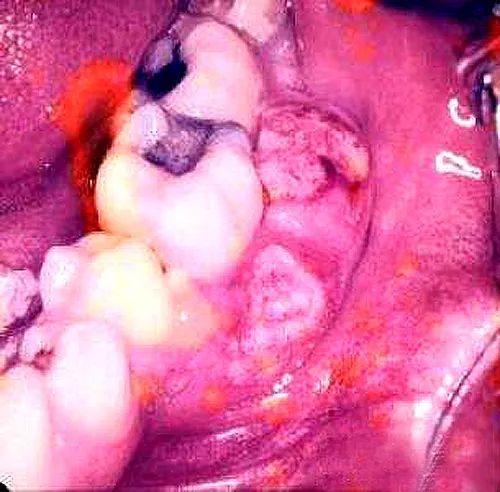

###  课件下载

[ <a href='chap01.pptx'>PPT点此下载</a>]

## 口腔颌面部肿瘤重点

 口腔颌面部是肿瘤的好发部位之一，可以发生各种类型的肿瘤。

### 一、良性肿瘤

口腔颌面部可发生各种良性肿瘤。发生于软组织者，如涎腺混合瘤、牙龈瘤、血管瘤、淋巴管瘤、神经纤维瘤、纤维瘤等。发生于骨组织者，如巨细胞瘤、骨瘤等。口腔颌面部还有些良性肿瘤与成牙组织有关，属牙源性的肿瘤，如牙瘤、造釉细胞瘤等。现将几种常见的肿瘤分别叙述如下。

#### （一）混合瘤（多形性腺瘤）（Mixed Tumor,Pleomorphic adenoma）

涎腺混合瘤为口腔颌面部最常见的肿瘤之一。来源于涎腺上皮。肿瘤内除上皮成分外，还常有粘液、软骨样组织等。涎腺混合瘤好发于腮腺（图1），其次为腭部及颌下腺。下面以腮腺混合瘤为例叙述其临床表现及治疗原则。

图1 腮腺混合瘤(左腮部)

【临床表现】

腮腺混合瘤多见于中年。一般无明显自觉症状，生长缓慢，病程可达数年甚至数十年之久。肿瘤多表现为耳下区的韧实肿块，表面呈结节状，边界清楚，中等硬度，与周围组织不粘连，有移动性，无压痛。如肿瘤出现下述情况之一时，应考虑有恶变之可能。①肿瘤突然增长迅速加快，②移动性减少甚至固定，③出现疼痛或同侧面瘫等。

【治疗原则】

腮腺混合瘤的治疗以手术彻底切除为原则。术前一般不宜作活检。肿瘤的包膜常不完整，有时瘤细胞可侵入包膜或包膜外组织，若切除不彻底则将复发。故手术时不宜采用剜除肿瘤的方法而应将肿瘤连同其周围的腮腺组织一并切除。术中要注意保持面神经。如有恶性变，应按恶性肿瘤的治疗原则处理。

#### （二）成釉细胞瘤（Ameloblastoma）

成釉细胞瘤是一种常见的、来自牙源性上皮的颌骨中心性肿瘤。瘤细胞的形态与牙胚中的成釉细胞相似，故称为成釉细胞瘤。

【临床表现】

成釉细胞瘤多见于青壮年，好发于下颌磨牙区及升支部。生长缓慢，病程较长，可数年至十年。一般无明显自觉症状。肿瘤大小不等，可为实质性或囊性。由于肿瘤逐渐增大使颌骨膨隆，颜面出现畸形，皮层骨受压吸收、变薄，按之常有“乒乓球”样弹性感觉。当肿瘤侵犯牙槽骨时，可使牙齿移位、牙根吸收、松动甚至脱落。如并发感染可出现红肿、疼痛等炎症症状。肿瘤继续增大，皮层骨质完全吸收，即向颌骨外扩展，可影响咀嚼、语言等功能。

X线检查可助诊断，其表现不一（图2），可为蜂窝状，皂泡状或多房性囊肿样阴影。以多房型多见，呈多个圆形或卵圆形，大小不等的透射区阴影，相互重叠或融合，边缘呈切迹状。少数可表现为单囊型阴影。

 

图2 X片示：成釉细胞瘤（下颌体部）

【治疗原则】

采用手术治疗。本病虽属良性肿瘤，但呈局部浸润性生长。单纯挖除的手术方法，容易复发，而且反复发作，可发生恶性变。因此，一般在肿瘤外正常骨质处，将颌骨包括肿瘤整块截除。作下颌骨截骨时，最好能同时植骨以维持外形及恢复下颌骨的功能。

#### （三）血管瘤（Hemangioma）

血管瘤是口腔颌面部常见的良性肿瘤。多属先天性，是由血管内皮增生而来。多见面部皮肤、皮下组织和口腔粘膜（如唇、舌、颊、口底等）（图3，图4，图5，图6）。一般可分为毛细血管型血管瘤、海绵状血管瘤及蔓状血管瘤。而以前两种常见。

|         |               |
| ---------------------- | ---------------------------- |
| 图3 毛细血管瘤(左面部) | 图4 海绵状血管瘤(舌及左颊部) |
|         |               |
| 图5 面部血管瘤         | 图6 舌部血管瘤               |

【临床表现】

毛细血管型血管瘤：肿瘤是由大量交织、扩张的毛细血管组成。表现为鲜红或紫红色斑块。与皮肤表面平齐或稍隆起，边界清楚，形状不规则，大小不等。以手指压迫肿瘤时，颜面退去；压力解除后，颜色恢复。

海绵状血管瘤：肿瘤由扩大的血管腔和衬有内皮细胞的血窦组成。血窦大小不一，有如海绵状结构，窦腔内充满静脉血，彼此交通。表现为无自觉症状、生长缓慢的柔软肿块。头低位时，肿瘤因充血而扩大，恢复正常体位后，肿块即恢复原状。表浅的肿瘤，表面皮肤或粘膜呈青紫色。深部者，皮色正常。触诊时肿块柔软，边界不清，无压痛。挤压时肿块缩小，压力解除后则恢复原来大小。

蔓状血管瘤：主要由扩张的动脉与静脉吻合而成。肿瘤高起呈念珠状或蚯蚓。扪之有搏动感与震颤感，听诊有吹风样杂音。若将供血的动脉全部压闭，上述之搏动及杂音消失。

【治疗】

血管瘤的治疗方法很多，应根据肿瘤的类型、部位、深浅及病员的年龄等因素而定。常用的方法有：手术切除、放射治疗、冷冻外科、硬化剂注射及激光照射等。

###  二、口腔颌面部恶性肿瘤（Malignat tumor of the Oral Cavity）

口腔颌面部的恶性肿瘤以癌为常见，肉瘤较少。癌肿中绝大多数为鳞状细胞癌，其次为腺性上皮癌，还有基底细胞癌、未分化癌、淋巴上皮癌等。

口腔癌大部分发生于暴露部位，且常有癌前病变过程，这对口腔癌的早期发现、早期治疗是有利条件。所谓癌前病变是一种可能演变为癌的病理变化，如白斑、皲裂、色素斑、慢性溃疡等。并非所有这些病变都会发展为癌，还要取决于其他因素，最后演变为癌的仅为少数。为了预防口腔癌的发生，应积极治疗上述病变，并消除各种不良的慢性刺激因素，如戒烟、拔除残根及残冠和去除不良修复物等。对于可疑病变，应严密随访，必要时作活检或切除。

临床表现

口腔癌按其发生部位可分为龈癌（Carcinoma of gingiva）、唇癌（Carcinoma of lip）、颊癌（Carcinoma of buccalmucosa）、舌癌（Carcinoma of tongue）、口底癌（Carcinoma of floor of the mouth）、腭癌（carcinoma of palate）、上颌窦癌（Carcinoma of the maxillary sinus）等（图7-11）。一般认为口腔前部的癌肿分化程度较高，口腔后部的癌肿分化程度较低。

 

图7上颌窦癌

口腔癌常表现为溃疡型、浸润型和乳头型三种。初起时常为局部溃疡、硬结或小结节。一般无明显的自发性疼痛，随着癌肿迅速生长并向周围及深层组织浸润，可出现疼痛。硬结扩大、肿物外突、表面溃疡、或边缘隆起呈菜花状，基底硬，中心可有坏死，有恶臭。常伴有感染，表面易出血。不同部位的癌肿因破坏邻近组织、器官而出现不同的症状和功能障碍。如舌癌有明显的疼痛和不同程度的舌运动受限、影响吞咽、说话等功能，恶性程度较高，发展快，早期即可有淋巴结转移。龈癌常波及牙槽骨，易使牙齿松动或脱落，继续扩展可侵犯颌骨，在上颌骨可侵入上颌窦，在下颌骨可累及下牙槽神经，引起疼痛或麻木。

口腔癌的转移，主要是循淋巴引流至区域淋巴结，最常见的是颌下淋巴结和颈深淋巴结。少数可循血行转移。晚期可有远处转移，常见的是肺，并可出现恶病质。

|  |      |
| --------------- | ------------------- |
| 图8 唇癌(下唇)  | 图9 龈癌(左上牙龈)  |
|  |      |
| 图10 腭癌(左)   | 图11 舌及口底癌(左) |

治疗

应根据癌肿的病变情况（组织来源、分化程度、生长部位、病变大小、淋巴结转移等）和病员的全身状况来决定治疗方案。治疗措施有手术切除、放射治疗、化学药物治疗、免疫治疗、冷冻外科、激光及中草药治疗等。多数病例应采用综合治疗以取得较好的疗效。手术切除的目的仍是口腔癌的重要治疗手段。局部病灶应采用根治性切除，必要时尚需作颌下淋巴结清扫术或颈淋巴清扫术。

###  三、囊肿（Cyst）

口腔颌面部囊肿较为常见，根据其发生部位可分为软组织囊肿和颌骨囊肿两大类。其起源有牙源性（如根端囊肿、含牙囊肿）、滞留性（如粘液囊肿、舌下囊肿）及胚胎发育性（如面裂囊肿、甲状舌管囊肿、皮样囊肿等）。其中以根端囊肿、粘液囊肿、舌下囊肿较多见。

#### （一）根尖囊肿（Radicular Cyst）

根端囊肿是最常见的颌骨性牙源性囊肿。来自慢性牙周炎的根尖肉芽肿。由于慢性炎症的刺激，肉芽肿内的上皮组织增生，中央变性、液化，逐渐形成囊肿（图12）。囊肿内壁为复层鳞状上皮，外层有纤维组织。腔内含有淡黄色液体。

图12 根尖囊肿

【临床表现】

根端囊肿呈球形膨胀、缓慢生长。一般无明显自觉症状。囊肿逐渐增大，可影响颌骨和牙齿。如颌骨骨质因受压而吸收、皮质层变薄，向外膨隆，触诊时有“乒乓球”样弹性感。邻近牙齿可被挤压而移位或倾斜。穿刺检查可抽出淡黄色水样囊液。如并发感染，则出现炎症症状。X线检查有助于诊断。片中显示圆形椭圆形边缘整齐的透射区、与牙根相连。

#### （二）粘液囊肿（Mucocele）

粘液囊肿通常是由于粘液腺管阻塞、粘液潴留所致，可发生于唇、颊、舌粘膜，而以下唇较多见（图13）。

【临床表现】

粘液肿肿位于粘膜下，约黄豆大小，呈半透明的无痛小疱。破裂后可流出粘液，肿胀消退，但不久又可复发。多次复发后，囊肿表面常因疤痕而呈灰白色。

 

|    |
| ----------------- |
| 图13 下唇粘液囊肿 |

#### （三）舌下腺囊肿（Ranula）

舌下腺囊肿是由于舌下腺导管阻塞，唾液潴留所引起。

【临床表现】

通常先起于一侧口底舌下区（图14），增大时可扩展于对侧，有时也可扩展至颏下或同侧颌下部。囊肿位于口底粘膜的深面，呈淡黄色、半透明的柔软包块。触诊有波动感，无压痛。增长缓慢。囊肿很大时，可影响说话、吞咽甚至呼吸。如并发感染可有疼痛等炎症表现。囊肿破裂时，溢出蛋清样粘稠液体，包块消失，但可复发。

 

图14 舌下腺囊肿(左)

### 口腔颌面部肿瘤案例分析

#### 一、理论基础

口腔颌面部肿瘤的患病率与全身其它部位相比并不算高，由于有瘤样病变归属于良性肿瘤中，所以一般说良性肿瘤多于恶性肿瘤。从组织来源讲，无论是良性肿瘤还是恶性肿瘤多数来自 上皮组织。良性肿瘤肿牙源性的较多，恶性肿瘤中以**鳞状细胞癌**最多 。发病部位:**舌癌**最多，其次是颊癌。有关口腔癌的诊断和治疗方法发展很快，目前有大量的研究集中于此，有分子生物学方面的，基因方面的等等。 尽管如此，临床上对于如何正确、早期诊断肿瘤，正确治疗肿瘤仍有许多问题。

#### 二、典型病例分析

病例  舌癌（病例来源于第九人民医院北院肿瘤科）

病史特点

①男，57岁，无高血压病、糖尿病等基础病史。

②2015.6 左侧舌部花生粒大小肿物，无明显诱因逐渐增大，伴疼痛、出血以及吞咽和构音困难，当地医院就诊无效，于2015年8月前往第九人民医院就诊。

③8月5日九院CT检查提示左侧舌根部占位，右侧ⅠB、Ⅱ区淋巴结异常强化（对侧淋巴结肿大）。

④8月15日行肿块穿刺活检：左舌黏膜鳞状上皮瘤样增生，中重度异常增生，癌变（分化较好的鳞状细胞癌）。

影像学：原发灶

 

淋巴结

 

知识点：淋巴结转移征象

①直径＞1cm

②强化

③中心液化坏死，环形强化

 

诊断：左侧舌癌（鳞癌）

分期：T2N2cM0， ⅣA期

治疗方案：先行化疗后手术治疗

诱导化疗：8.26日行泰素帝 120mg d1+ 伯尔定500mg d1化疗（干预前美兰标记原始病灶范围）

 

 

化疗后：发音、吞咽明显好转，已出院，化疗后2周左右前往颌面外科就诊

知识点：舌癌

是口腔颌面部常见的恶性肿瘤，是口腔癌中第一大癌，45.9%。

男性多于女性，多数为鳞状细胞癌，特别是在舌前2/3部位，腺癌比较少见，多位于舌根部

舌根部有时亦可发生淋巴上皮癌及未分化癌

多发生于舌缘，其次为舌尖、舌背及舌腹等处，可有局部白斑病史或慢性刺激因素

常为溃疡型或浸润型，一般恶性程度较高，生长快，浸润性强，常波及舌肌，致使舌运动受限，疼痛明显，使说话、进食及吞咽均发生困难

早期常发生颈淋巴结转移（隐性转移50%–60%）

舌体具有丰富的淋巴管和血液循环，机械运动频繁，转移较早且转移几率较高

舌背或越过舌体中线的舌癌可以向对侧颈淋巴结转移

舌前部的癌多向颌下及颈深淋巴结上、中群转移

舌尖部癌可以转移至颏下或直接至颈深中群淋巴结

舌根部的癌不仅转移到颌下或颈深淋巴结，还可能向茎突后及咽后部的淋巴转移

舌癌还可发生远处转移，一般多转移至肺部

鉴别诊断

①良性溃疡

有诱因，周期性发生，自行愈合

②结核性溃疡

多发生于舌背，偶见于舌尖和舌边缘。溃疡表浅，紫红色，边缘不整，呈鼠咬状口小底大的潜行性损害，基底无浸润。患者常有结核病史

治疗

①以手术为主的综合治疗，一般应行原发病切除及颈部淋巴结清扫术，术后配合放疗或化疗

②T1楔状切除，直接缝合；T2-T4应行半舌切除直至全舌切除。舌缺损1/2以上时应行同期再造术

③3-5年生存率一般在60％以上，T1病例可达90％以上　

 

 