##  课件下载

[ <a href='chap01.pptx'>PPT点此下载</a>]

## 口腔颌面部解剖重点

 第一章 口腔颌面部解剖   

第一节 概述

口腔（oral cavity）前壁为唇，经口裂通向外界，后经咽门与口咽槽骨形成牙弓将口腔分为两部分，牙列与唇颊之间为口腔前庭（oral vestibulum）,牙列以内为固有口腔（oral cavity proper）。

口腔前庭：位于唇、颊与牙列、牙龈及牙槽骨牙弓之间的蹄铁形的潜在腔隙。在口腔前庭各壁上，可见口腔前庭沟、上下唇系带、颊系带、腮腺导管口、磨牙后区和翼下颌皱襞。

固有口腔：口腔的主要部分，其范围上为硬腭和软腭，下为舌和口底，前界和两侧界为上、下牙弓，后界为咽门。具有临床意义的解剖主要有腭、舌、舌系带、颌下腺导管开口和口底。

第二节 牙体和牙周组织

1.牙位记录

牙齿分类、名称及临床牙位记录法。人一生中先后要长两次牙齿，即乳牙和恒牙。乳牙20个，恒牙28~32个（图1、2）。根据牙的形态特点和功能特性，恒牙分类中切牙、侧牙牙、尖牙、双尖牙（第一、二前磨牙），磨牙（第一、二、三磨牙）。乳牙没有双尖牙及第三磨牙。

| 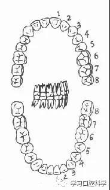 | 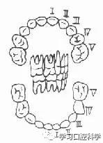 |
| -------------------- | -------------------- |
| 图1  恒牙32个        | 图2  乳牙20个        |

为了缩减临床书写或口述牙的全名，常用代号来表示，目前最常用的方法有：

以“＋”符号将上下牙弓分为四区。符号的水平线用以区分上下；垂直线用以区分左右。或以a B C D分别代表各区，A代表右上区，B代表左上区，C代表右下区，D代表左下区。恒牙用阿拉伯数字1、2、3、4、5、6、7、8代表，乳牙用罗马数字Ⅰ、Ⅱ、Ⅲ、Ⅳ、Ⅴ代表，乳牙名称及代号见（图3），恒牙名称及代号见（图4），例如：

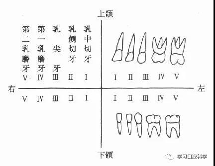

图3 乳牙名称和代号

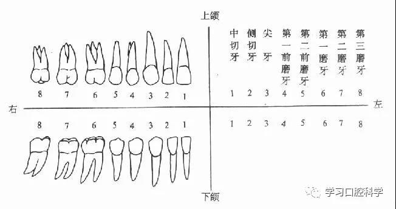

图4 恒牙名称和代号

 2.牙齿的表面

从外部观察，牙体由冠、牙根及牙颈三部分组成（图5）。

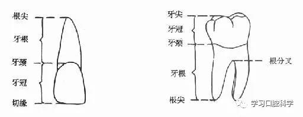

图5 牙齿的表面解剖名称

牙根的数目：各个牙齿的牙根数目不尽相同，归纳如下。

3．牙齿组织结构

牙齿由牙釉质、牙本质、牙骨质和牙髓四部分组成（图6）。

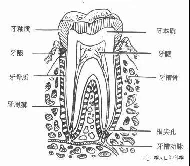

图6　牙齿组织结构

4．乳恒牙萌出时间及鉴别要点。

幼儿6个月左右开始萌出乳牙，2－3岁时，乳牙全部萌出，共20个。6岁时前后开始长出恒牙，脱换乳牙，12－13岁时，乳牙脱换完毕，恒牙共长出28个。一般从17岁后开始长出第三磨牙（又称智齿），也有的人终生不长智齿，或只长一两个智齿，因此成人恒牙数目可以是28－32个。

乳恒牙的鉴别要点：乳牙一般比恒牙小，形态上乳磨牙颈部宽而面略小，恒磨牙面宽而颈部略小，乳切牙冠部一般比恒切牙冠部短小且窄。在乳恒牙交换时间，应注意两者的鉴别，避免误诊。

5.牙周组织

牙周组织包括牙龈、牙周膜、牙槽骨三部分。

第三节 颌面部解剖（Maxillo-facial-Anatomy）

颌面部根据其解剖特点和临床应用的需要，可分为下述各区：1．颧部，3．鼻部，5．唇部，7．颊部，8．咬肌部，9．腮腺部，10．颏部，11．颏下部，12．颌下部。

一、颌骨

上颌骨（maxilla）

上颌骨居颜面中部，左右各一，互相连接构成中面部的支架。上颌骨有体部和四个邻近骨相连的骨突，额突、颧突、腭突和牙槽突。额突与额骨相连，颧突与颧骨相连，腭突在上腭中缝部左右对连，牙槽突即牙齿所在部位的骨质。

上颌骨体部内为一空腔，即上颌窦，上颌窦底骨壁较薄，距离后牙牙根很近，后牙根尖部感染可向上蔓延造成牙源性上颌窦炎。上颌窦肿瘤或其它病变，有时可出现牙齿疼痛和松动等症状。有时因拔牙手术不慎，可造成口腔上颌窦穿通，或将牙断根推入上颌窦内。这些解剖特点和临床上的关系，应该引起注意。

根据解剖结构上的薄弱环节，上颌骨骨折有三种经典类型。第一型骨折（Lefort Ⅰ型骨折）其骨折线通过梨状孔下缘、上颌窦下部，横行到双侧上颌结节；第二型骨折（LeFort Ⅱ型骨折）的骨折线通过鼻骨、泪骨、眶底、颧骨下方，达到上颌骨后壁；第三型骨折（LeFort Ⅲ型骨折）的骨折线也通过鼻骨、泪骨，但横过眶窝及颧骨上方，向后到上颌骨后壁，使上颌骨、颧骨与颅骨完全分离，因此又称为颅面分离。

下颌骨（mandible）

下颌骨分为体部及升支部，两侧体部在正中联合。下颌升支部上方有两个骨性突起，在后方者称为髁状突，在前方者称为喙突（肌突），两者之间的凹缘称为乙状切迹。升支部后缘与下颌骨下缘相交处称为下颌角，升支部内侧面中部有一个孔称下颌孔，此孔在下颌骨内向下向前延伸的管道，称下颌骨。下颌管在第一、第二前磨牙牙根之间向外穿出一孔，称颏孔。下牙槽神经、血管从下颌孔进入下颌管向前走行，在颏孔处分出颏神经及血管（图7）。

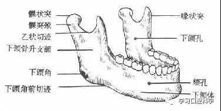

图7　下颌骨

由于下颌骨在髁状突颈部、下颌角部、颏孔部、正中联合部等处的结构比较薄弱，故外伤时常易发生骨折。

二、肌肉

颌面部肌肉可分为咀嚼肌及表情肌两类。咀嚼肌又分为升颌肌群和降颌肌群两组（图8，9）。它们相互交替收缩和舒张，即形成张口和闭口活动，以完成咀嚼等功能。详见表1。

表1　口腔颌面部咀嚼肌

|            | 肌肉                                         | 起端                       | 止端                                               | 功能                                     | 神经支配         |
| ---------- | -------------------------------------------- | -------------------------- | -------------------------------------------------- | ---------------------------------------- | ---------------- |
| 升颌肌群   | 咬肌                                         | 上颌骨颧突及颧弓下缘       | 下颌升支下颌角外侧面                               | 提下颌向上                               | 三叉神经肌支     |
| 颞肌       | 颞骨骨面                                     | 下颌骨喙突                 | 提上颌向上，后部肌纤维可拉下颌骨向后               | 三叉神经颞肌支                           |                  |
| 翼内肌     | 翼外板内侧面                                 | 下颌升支及下颌角内侧面     | 提下颌向上，并有前伸及侧颌功能                     | 三叉神经翼内肌支                         |                  |
| 降颌肌群   | 翼外肌                                       | 翼外板外侧面，蝶骨大翼下面 | 下头止于踝状突颈，上头止于颌关节盘前缘及部分关节囊 | 主要是张口和前伸，单侧收缩则下颌偏向对侧 | 三叉神经翼外肌支 |
| 二腹肌     | 前腹起于下颌骨二腹肌凹，后腹起于颞骨乳突切迹 | 舌骨体中间腱               | 降下颌，提舌骨向上                                 | 前腹：三叉神经后腹：面神经               |                  |
| 颏舌骨肌   | 下颌骨颏棘                                   | 舌骨体前面                 | 降下颌，提拉舌骨向上、前                           | 舌下神经                                 |                  |
| 下颌舌骨肌 | 下颌骨内侧颌舌线                             | 舌骨体                     | 降下颌，得舌骨向上                                 | 三叉神经下颌舌骨肌支                     |                  |

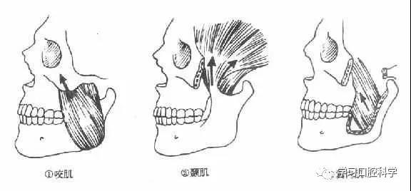

图8  升颌肌群

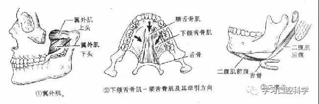

图9　降颌肌群

表情肌多起于颜面骨壁，止于面部皮肤，分布在颜面、口、眼、鼻周围（图10）。不仅具有表情功能，而且参与语言、咀嚼和口、眼的张闭等功能。面部表现肌由面神经支配，故面神经损伤或麻痹时即出现口眼歪斜等症状。

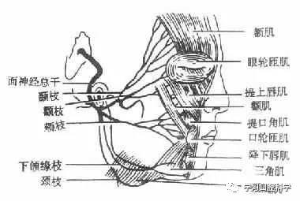

图10 面部表情肌及面神经分支

三、血管

口腔颌面部血液供给主要来自颈外动脉，其分支有舌动脉、颌外动脉（面动脉）、颌内动脉、颞浅动脉、眶下动脉、唇下动脉、唇动脉、上下牙槽动脉、颏动脉等（图11）。这些动脉的分支构成密集的血管网，使颌面部组织有丰富血运，因此外伤容易出血，但另方面组织愈合再生能力和抗感染能力较强。

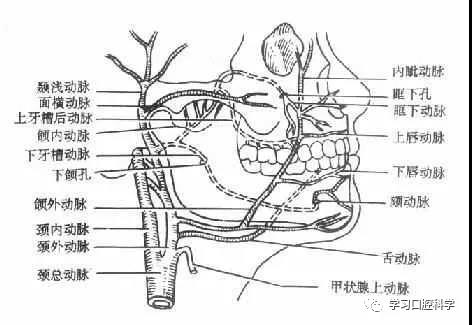

图11　口腔颌面部动脉

口腔颌面部静脉（图12）由面前静脉及面后静脉汇合而成总静脉再流入颈内静脉。颌面部静脉的特点是没有静脉瓣，面前静脉通过眼静脉、翼静脉丝与颅内海绵窦相交通，因此面部炎症有向颅内扩散的可能。

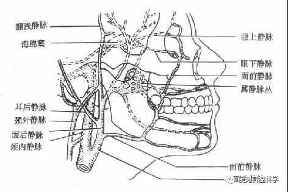

图12　口腔颌面静脉

四、淋巴

口腔颌面部淋巴组织比较丰富，是重要的防御机构。主要的淋巴结群按解剖区域可分为面部淋巴结、颌下部淋巴结、颈部淋巴结三组。面部淋巴结包括颊淋巴结、眶下淋巴结、腮腺淋巴结等。颌下部淋巴结包括颏下淋巴结和颌下淋巴结。颈部淋巴结包括颈深淋巴结和颈浅淋巴结（图13）。这些淋巴结与其引流部位组织的炎症扩散、肿瘤转移等有密切关系。

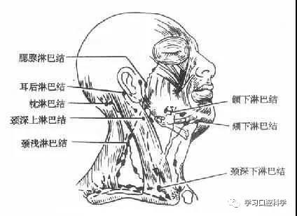

图13　口腔颌面部淋巴

五、神经

口腔颌面部的神经主要有面神经和三叉神经。

面神经（facial nerve）

面神经为第Ⅶ对颅神经。从茎乳孔出颅腔后，其主干穿过腮腺，然后分为五个末梢支：颞支、颧支、颊支、下颌缘支和颈支。前4个分支的主要功能是支配颜面部表情肌的运动。颈支分布于颈阔肌。面神经另有一个分支鼓索神经参加到舌神经里，分布于舌体部，司理味觉。此外还有分支到颌下腺及舌下腺，司理唾液分泌。颌面部手术时，特别是腮腺手术应注意防止误伤面神经而造成面瘫。腮腺肿瘤如伴有面瘫，应考虑恶性的可能。

三叉神经 （trigeminal nerve）

三叉神经是第Ⅴ对颅神经，有感觉纤维和运动纤维。感觉纤维由颅内三叉神经半月节分出眼支、上颌支、下颌支、下颌支分别出颅，分布于头面部及口腔司理感觉。运动纤维则伴随下颌支走行出颅，分布于颞肌、咬肌、翼内肌、翼外肌、下颌舌骨肌，二腹肌前腹司运动。

六、唾液腺（Salivary Gland ）

口腔的大涎腺有腮腺，颌下腺，舌下腺三对。（图14）

腮腺（Parotid Gland）：位于耳下区，是涎腺中最大的一对，在面神经干及其分支从其中穿过。腺体外有致密的腮腺包膜，腺体内亦有许多隔膜，将腺体外分隔成若干小叶。从腮腺前缘发出腮腺导管。导管向前行越过咬肌表面，在咬肌前缘转入口腔，开口在上颌第一磨牙相对的颊粘膜处。

颌下腺（submaxillary gland）：体积小于腮腺，位于颌下三角，腺体主要在下颌舌骨肌下方，部分从该肌后缘转向其上方，并发出颌下腺导管，在口底粘膜下向前行走，开口于舌系带基部的两侧。导管在行程中还接受部分舌下腺小管开口。

舌下腺（sublingual gland）：为大涎腺中最小的一对，位于舌系带两边的口腔粘膜与下颌。

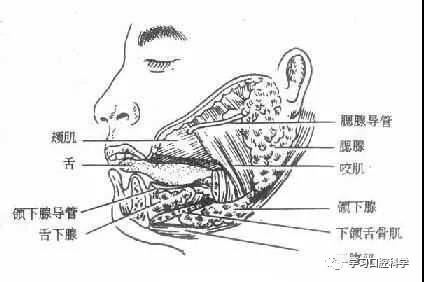

图14　唾液腺

七、颞下颌关节（temporomandibular joint）

颞下颌关节由下颌关节凹、髁状突、关节盘和关节囊所组成，邻近并有韧带附着。

颞下颌关节是具有转动和滑动的左右联动关节。颞下颌关节主要有开闭口、前伸和侧方运动三种基本形式。这些运动是通过咀嚼肌群、韧带、关节之间互相协调的动作而产生的。

## 口腔颌面部解剖相关病例分析

病例1．一男性患者，37岁，因车祸送来急救。检查发现：双侧眶周围皮下淤血，形成“熊猫眼”，鼻腔内流淡粉红色液体，嗅觉障碍。从解剖学角度分析，为何出现上述症状?

  分析：该患者为颅前窝骨折，累及筛板及眶板。颅前窝底即为眼眶顶，薄弱易破，两侧眶顶间为筛板，为鼻腔顶，其中有许多小孔为嗅神经纤维和筛前动脉通过。该患者有外伤史且受力点在额眶部，导致颅前窝骨折累及筛板，撕破该处硬脑膜及鼻腔顶粘膜，出现了脑脊液鼻漏并伤及嗅神经使嗅觉障碍，同时，外力使眶板骨折出现球结膜下出血和眼睑皮下淤血，故表现为双眼眶周青紫现象，俗称“熊猫眼”。

病例2．一学生，男，22岁，因球砸伤面左侧部，患者张口受限约lcm左右，左颧面部肿胀，皮下出血，压痛存在，口内咬合关系良好，X线提示颧弓“M”型骨折，如何解释该患者症状和体征?   

  分析：这是一个典型的单纯颧弓骨折的病例。颧弓和颧骨是面部比较突出的部分，常因受外力直接打击而发生骨折，其中尤以颧弓骨折多于颧骨骨折。颧弓是由颧骨颞突和颞骨颧突连接而成，此处较薄弱，骨折时多发生内陷移位，压迫颞肌以及内侧的下颌骨喙突而导致张口受限，甚至不能张口，局部疼痛，伤侧面部早期扁平，数小时后随着软组织肿胀而不易觉察，只有靠手指触诊方可诊断。常见的骨折类型有：三线骨折(“M”型)和双线骨折。

病例3．某女青年，鼻旁生一绿豆大小的疖肿，因嫌其影响美观，自行对疖肿进行挤压。5日后出现头痛、双眼周围肿胀，眼球外突，呼吸急促而入院，经抗炎和对症处理，无效而死亡，试分析其死亡原因。

  分析：此处静脉血回流通过面静脉，该处(特别是鼻根部与口角连线的区内，称面部危险三角区)脓血栓由于唇部肌肉的活动有可能进入面静脉，该静脉有时缺少静脉瓣(特别是口角连线的上方静脉瓣的出现率少)。如处理不当(局部挤压、搔刮等)，脓栓可经眼下静脉、面深静脉和翼丛逆行向颅内播散，引起海绵窦化脓性血栓性静脉炎而出现上述症状，严重的可导致死亡。