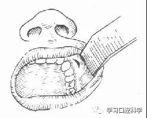
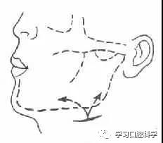

##  课件下载

[ <a href='chap04.pptx'>PPT点此下载</a>]

## 口腔颌面部感染重点

### 一、智齿冠周炎（Pericoronitis）

智齿（第三磨牙）牙冠周围的软组织炎症为智齿冠周炎。常发生于18-25岁的青年，是部队常见口腔疾病之一。

病因

第三磨牙萌出过程中或萌出困难时，牙冠的一部分被游离的牙龈部所覆盖，在牙冠与龈瓣之间形成盲袋（龈袋），盲袋内经常有食物残渣和细菌存留。这种局部条件使细菌易于生长、繁殖。若感冒、疲劳或其他原因致机体抵抗下降，或由于局部创伤（如对颌牙咬伤）等因素，可诱发智齿冠周炎。因下颌第三磨牙萌出常缺乏足够位置而易形成阻生，故本病多见于该牙。临床上常见的阻生情况有近中阻生、水平阻生和垂直阻生等。

临床表现

急性智齿冠周炎的主要症状为牙冠周围软组织肿胀疼痛。如炎症影响咀嚼肌，可引起不同程度的张口受限，如波及咽侧则出现吞咽疼痛,导致病员咀嚼、进食及吞咽困难。病情重者尚可有周身不适、头痛、体温上升、食欲减退等全身症状。

 

图1 冠周的盲袋及肿胀之龈瓣

检查可见下颌第三磨牙萌出不全、有龈瓣覆盖、盲袋形成。牙冠周围软组织红肿、龈瓣边缘糜烂、盲袋内有脓性分泌物（图1）。有时可形成冠周脓肿，出现颌面肿胀，同侧颌下淋巴肿大，压痛。

急性冠周炎如未能彻底治疗，则可转为慢性，以后反复发作，甚至遗留瘘管。若炎症继续扩展，可发生下述各种并发症。例如蔓延至骨膜下形成骨膜下脓肿；或脓液沿下颌骨外侧骨面向前流注，可在相当于下颌第一或第二磨牙颊侧形成脓肿或龈瘘；也可向外扩展，形成颊部皮下脓肿，或穿破皮肤形成皮瘘。在临床上可见有颊部皮瘘的患者，应考虑有冠周炎的可能，防止误诊。冠周炎严重者，尚可并发颌周蜂窝织炎、下颌骨骨髓炎甚至全身性的感染。

治疗

智齿冠周炎的治疗主要是增强患者机体抵抗力，控制感染，促使炎症消散。急性期过后，应考虑对病源牙采用外科治疗，以防复发。

1．全身治疗

根据病情选用抗菌物或内服清热、解毒的中草药进行治疗。

2．局部治疗

智齿冠周炎的局部治疗很重要。每日可用1－3％过氧化氢溶液及生理盐水或其他灭菌溶液冲洗盲袋，然后点入3％碘甘油。另给复方硼砂液或呋喃西林液等含漱，一日多次。早期还可局部理疗、外敷中草药以助炎症吸收。针刺疗法可有镇痛、改善张口等作用。如脓腔形成，可切开引流。

3．病源牙处理

急性炎症消退后，应对病源牙作进一步处理，以防复发。如牙位正、能正常萌出，并有对颌牙行使咀嚼功能者，可作冠周龈瓣楔形切除术（图2）。否则应予拔除。

 

①切口②切除牙龈后露出全部牙冠③缝合

图2下颌第三磨牙冠周龈瓣楔形切除术

### 二、颌周蜂窝织炎（PerimaxillaryCellulitis）

颌周蜂窝织炎是指发生在颌骨周围筋膜间隙组织的急性炎症。在上下颌内周围分别有咀嚼肌及表情肌等。这些肌肉之间、肌肉与颌骨之间充满疏松的结缔组织，形成一些潜在的间隙。因解剖部位的不同，各间隙有其特定的名称，如咬肌下间隙、颌下间隙等。感染入侵这些部位时，便可发生颌周蜂窝织炎或称间隙感染。如治疗不及时或治疗不当，可蔓延至其他间隙，甚至引起严重的全身并发症。

病因

颌周蜂窝织炎常见的感染来源有下列几种：

1．牙源性感染本病最常见的病因是牙源性感染扩散所致，如智齿冠周炎、尖周炎等。不同部位牙齿的感染常引起不同部位的蜂窝织炎。

2．局部组织感染如颌下淋巴结炎、面部疖痛等均可引起颌周蜂窝织炎。

3．外伤后并发感染。

临床表现

除具有一般蜂窝织炎的全身症状和局部表现外，由于各间隙的解剖特点，尚有其特殊的临床表现，将另行分别叙述。

治疗

1．全身治疗

主要为改善机体状况、增强抵抗力，选用抗菌药物以控制感染。如病情严重，可采用两种以上的抗菌药联合应用，必要时静脉给药。也可根据辩证论治的原则给以扶正祛邪、清热解毒、消肿散瘀等中药。

2．局部治疗

炎症早期可用局部理疗、外敷中草药等促进炎症吸收。脓肿形成时应及时切开引流。切开引流时，切口应在利于引流的部位，避免损伤重要的神经、血管、导管等重要结构，部位要隐蔽并尽量与皮纹一致。在急性炎症控制后，对病源牙应用进一步处理。

不同部位蜂窝织炎的临床表现和治疗特点

#### （一）眶下蜂窝织炎（眶下间隙感染）（Infection of theInfraorbital Space）

感染发生于眼眶下方，上颌骨前壁与局部表情肌之间（图3）。多来自上颌尖牙等的牙源性感染（如尖周炎等），也可来自上唇或鼻侧的感染。

局部表现为眶下区红肿、疼痛。下眼睑水肿致睁眼困难。上唇肿胀，鼻唇沟消失。上颌前牙前庭沟处红肿。常可查见病源牙。

切开引流要点：一般在口内上颌尖牙区的前庭沟底部作横切口，深达骨面，向尖牙凹骨面分离，以达引流（图4）。

|       |            |
| ------------------------- | ------------------------------ |
| 图3眶下蜂窝织炎发生的部位 | 图4 眶下蜂窝织炎切开引流的切口 |

#### （二）咬肌下蜂窝织炎（咬肌下间隙感染）（Infection ofthe Submasseteric Space）

感染发生在下颌骨升枝外侧骨壁与咬肌之间（图5），主要来自下颌智齿冠周炎及下颌磨牙的尖周感染。在颌周蜂窝织炎中较为常见。

主要的临床特征是以下颌角为中心的咬肌腮腺部红肿、疼痛；由于炎症刺激，咬肌处于痉挛状态，致使局部发硬、张口受限甚至牙关紧闭；即使脓肿已经形成，早期时波动也不明显，且不易自行穿破，因此应及时切开引流。如不能确定脓肿是否成熟，穿刺检查有助于诊断。若延误治疗，未能及时切开引流，致使感染扩散，可能引起下颌骨骨髓炎。

切开引流要点：在下颌角下1.5－2cm处作与下颌骨平行的弧形切口长约3－5cm。分层切开皮肤、皮下组织及颈阔肌。然后向上暴露下颌骨下缘，注意避免损伤面神经下颌缘支及腮腺。切开下颌骨下缘处的咬肌附着，以长弯血管钳紧贴下颌骨外侧向上分离引出脓液，放置引流（图6）。

|        |        |
| -------------------------- | -------------------------- |
| 图5 咬肌下蜂窝织发生的部位 | 图6 咬肌下蜂窝织炎切开引流 |

#### （三）颌下蜂窝织炎（颌下间隙感染）（Infection ofthe submaxillary Space）

临床上较常见。感染发生在颌下三角区。多来自下颌磨牙的感染，亦可由颌下淋巴结炎所引起，后者尤多见于小儿。

局部表现为颌下区红肿、疼痛，皮纹消失、皮肤发亮，下颌下缘可因肿胀而不显（图7）。严重的颌下蜂窝织炎可蔓延至邻近间隙或颈部。

|  |
| -------------------- |
| 图7颌下蜂窝织炎(右)  |

切开引流要点：在下颌骨下缘约2cm处，作与下颌下缘平行切口切开皮肤、皮下组织及颈阔肌后，以血管钳分离引流。注意防止损伤面神经下颌缘支（图8）。

 

图8 颌下蜂窝织炎切开引流

#### （四）口底蜂窝织炎（Cellulitis ofFloor of the Mouth）

口底蜂窝织炎可由下颌牙齿感染、急性扁桃体炎、急性下颌骨骨髓炎或口底外伤继发感染而引起。本病虽较少见，却为口腔颌面部严重感染疾病之一。感染侵犯口底多个间隙。临床上分为化脓性和腐败坏死性二种，后者病情更为严重。

炎症一般开始发生于一侧舌下或颌下区，以后迅速扩展至颏下及对侧。当炎症波及口底各间隙时，双侧颌下及颏下区甚至上颈部广泛肿胀。头后仰，口半张。口内可见口底肿胀、舌上抬、舌运动受限。病员语言、吞咽困难。如肿胀向舌根部蔓延，可压迫咽部、会厌而引起呼吸困难甚至窒息。

口底腐败坏死性蜂窝织炎主要由厌气性、腐败坏死性细菌引起，病情发展迅速。全身中毒反应严重，脉搏频弱，呼吸短促，重者可出现体温不升、血压下降。局部明显肿、硬、皮色暗红，触诊可有捻发音。

治疗要点：本病的主要威胁为全身中毒及局部影响呼吸道通畅。如不及时正确治疗可危及病员生命，因此要积极采取综合治疗措施。全身联合应用大剂量抗菌素，保持水电解质平衡，增强病员抵抗力，局部要及时切开减压、引流，切口一般从一侧颌下到对侧颌下，必要时可作颏部辅助切口，逐层切开，切断部分口底肌肉打通脓腔，放置引流（图9）。口底腐败性蜂窝织炎还可以用放氧剂如1－35过氧化氢液或1:5000高锰酸钾液冲洗及湿敷创面。如有严重的呼吸困难，应及时做气管切开以保证呼吸通畅。

 

图9 口底蜂窝织炎切开引流

### 三、颌骨骨髓炎（Osteomyelitis of the Jaws）

颌骨骨髓炎可分为化脓性、特异性、放射性等几种。临床上以化脓性颌骨骨髓炎最为多见。

病因

颌骨骨髓炎的感染来源主要有三种途径，即牙源性、损伤性及血源性。损伤性的火器性颌骨骨髓炎在颌面损伤章内叙述。血源性颌骨骨髓炎较少见，主要发生于小儿。牙源性颌骨骨髓炎最多见，约占全部颌骨骨髓炎的90％。我国由于医药条件的改善，发病率已大为下降。牙源性颌骨骨髓炎多见，这与下颌骨皮层骨骨质致密、周围有肥厚肌肉及致密筋膜附着，髓腔脓液积聚不易穿破引流等因素有关。

临床表现和诊断

（一）急性颌骨骨髓炎

发病急剧，全身症状明显。局部先感病源牙疼痛，迅速延及邻牙，导致整个患侧疼痛并放散至颞部。面部相应部位肿胀，牙龈及前庭沟红肿，患区多个牙齿松动。常有脓液自牙周溢出。下颌骨骨髓炎，因咀嚼肌受侵、常出现不同程度的张口受限。下牙槽神经受累时，可有患侧下唇麻木。上颌骨骨髓炎多见于新生儿、婴儿，感染来源常为血源性。其局部表现为眶下部明显红肿，并常延至眼周致眼睁不开。后期可在内眦、鼻腔及口腔穿破溢脓。

（二）慢性颌骨骨髓炎

急性颌骨骨髓炎如未能彻底治疗，可转为慢性。常见的原因是单纯采用药物保守治疗，脓液自行穿破，引流不畅。慢性颌骨骨髓炎期间，急性症状大部消退，全身症状已不明显，疼痛显著减轻。局部纤维组织增生、肿胀、发硬。瘘管，经常溢脓，甚至排出小块死骨。病变区多个牙松动，龈隙溢脓。当机体抵抗力降低或引流不畅时，可急性发作。如拖延日久，可致消瘦、贫血、身体衰弱。

颌骨骨髓炎的X线检查，早期改变不明显。2－3周后，方逐渐显示弥漫性稀疏区。以后可见形态不规则的死骨。死骨如已完全分离则四周为黑色阴影所包绕。

预防和治疗

及时治疗冠周炎、尖周炎等牙源性感染，对预防发生颌骨骨髓炎有积极意义。如已形成骨髓炎，在急性期应予彻底治疗以免转为慢性。

急性颌骨骨髓炎的全身治疗与颌周蜂窝织炎相同，主要为增强机体抵抗力、药物控制感染。局部治疗重点在于及时切开引流，拔除病源牙。

慢性颌骨骨髓炎时应努力改善患者机体状况，保持引流通畅，及时拔除病源牙，彻底清除病灶、刮治或摘除死骨。

### 四、疖痛（Furuncle andCarbuncle）

疖痛好发于头面部，唇部多见且较严重。

唇部疖、痈的临床表现与身体其他部位者基本相同。要注意的是其局部解剖、生理的特殊性。面部经常活动，富于淋巴、血管网，血运丰富。其静脉无瓣膜，血液可逆行。在“危险三角区”，面部静脉经面前静脉、内眦静脉、眼静脉等与颅内的海绵窦相通（图10，11）。

|         |           |
| --------------------------- | ----------------------------- |
| 图10 面部“危险三角”区的静脉 | 图11 颌面部静脉与海绵窦的交通 |

由于上述特点，唇部疖痈若经挤压、搔抓等不正确处理，感染可扩散入血液循环引起败血症等全身性感染，或感染进入颅内导致海绵窦血栓性静脉炎。这些均可威胁病员的生命。

唇部疖、痈的全身治疗同一般的炎症。重点应注意局部正确处理、防止发生并发症。局部治疗主要采用非手术疗法，禁忌挤压、挑刺或早期切开。早期可作理疗、外敷拔毒膏、鱼石脂软膏或中草药。如有脓栓形成，可用小镊轻轻夹出，疖、痈部位可用高渗盐水或抗菌素液等湿敷。只有形成皮下脓肿后方可轻巧地切开皮肤，以利引流。平时应尽量减少局部活动。

## 口腔颌面部感染案例分析

### 一、理论基础

颌面部间隙感染是颜面、颌周及口咽区软组织肿大化脓性炎症的总称。脓性炎症弥散时称为**蜂窝织炎**，局限时称为**脓肿**。

正常颌面部各层组织之间存在潜在的筋膜间隙，当感染侵入这些间隙时，化脓性炎症使疏松结缔组织溶解液化，炎症产物充满其中，此时才出现明显的间隙。感染可局限于一个间隙内，也可循阻力薄弱的组织扩散，形成弥散性的多个间隙感染，如口底。

***病因***

1.最常见为牙源性感染

如下颌第三磨牙冠周炎，根尖周炎，颌骨骨髓炎等；

2.其次是腺源性感染

可由扁桃体炎，唾液腺炎，颌面部淋巴结炎等扩散所致，在婴幼儿中多见继发与创伤面部疖痈口腔溃疡和血源性感染者已少见。

间隙感染的病原菌以溶血性四链球菌为主，其次为金黄色葡萄球菌

常为混合性细菌感染，厌氧菌所致的感染少见。

 

  ***临床表现***

1.轻者无明显全身症状，重者高热、寒战、脱水、白细胞增高、食欲不振、周身不适；

2.局部表现为发红、肿胀、皮温高、疼痛，涉及咀嚼肌的间隙感染，有张口受限，位于舌、口底、咽旁者则出现进食、吞咽或呼吸困难。

3.区域性淋巴结肿大、压痛；

4.腐败坏死性感染者，全身中毒症状严重；局部为弥散性肿胀、皮肤紧张发亮，呈暗红色，有捻发音；

### 二、典型病例分析

病例  颌面部多间隙感染

病史：患者颜某，女，39岁，于2015年8月19号扶入抢救室。主诉：“右面部肿痛4周余，呼吸困难6日”入院时神志清楚， BP：109/86mmHg；P85次/分；R19次/分；SaO298%。患者缘于右下后牙疼痛20余日，就诊于外院行抗感染治疗（具体不详），症状未见好转，4日余前右面颈部肿痛，呼吸困难6日余，症状逐渐加重。为进一步治疗急诊入我院。该患者于17:15入抢救室，安排于1D的位置，口腔科首诊，当时陈X医师值11-6班，给予患者吸氧，上心电监护，描床边心电图，示窦性心律。予抽血急查血常规、电解质、肝、肾功能、CRP、血糖并建立静脉路予以林格500mlivgtt治疗。诊断：“颈面部多间隙感染”。请耳鼻喉科会诊：建议1，保持呼吸道通畅，2，建议手术室行气管切开术。

***既往史、个人史、家族史：***否认高血压、糖尿病、心脏病、过敏史。

***体格检查：***右面部、双侧颌下、颏上区、颈上部肿胀明显，皮温升高，以及凹陷性  水肿，口底肿胀明显，伸舌困难。

患者由于口底肿胀造成插管困难，请麻醉科医生插管。 18:30 邓X医师接班辅助医生插管并准备吸痰， 麻醉医生鼓励患者咳嗽，立即在纤支镜引导下成功行气管插管术，距离门齿23厘米，固定妥当，接鼻导管5L/分吸氧，医生诉可视纤支镜下无痰液无分泌物。医生开好住院单，嘱家属立即办住院，护士立即护送患者行CT检查，带好简易呼吸器，心电监护。责任护士及主管护师要求口腔医生一同陪做检查，口腔科医生认为患者已行气管插管术，保持呼吸道通畅，且生命征平稳，拒绝一同护送检查。此时BP：120/79mmHg；P106次/分；R19次/分；SaO299%。19:00，患者生命征平稳，护送患者至口外住院。与护士做好交接。

***病历追踪***：

19:00报告出来：各项检查回报：血常规示白细胞27.20*10⒐g/l、中性粒细胞89.5%，凝血全套凝血酶原时间15.3秒,纤维蛋白原定量9.36秒，急诊生化肌酐：30.4umol/L,

钾3.25mmol/l，CRP>90mgl/l.

患者在XX时间在手术室行“口底、颈部多发间隙感染脓肿切开术+VSD置入术+气管切开术”，术毕平车返回病房，去枕平卧位，头偏向一侧，气管套管固定妥当，气道通畅，按气管切开常规护理，按时湿化气道，痰多粘稠，呈黄色，予及时吸除。下颌部红肿，予颏下创面24小时持续冲洗引流，创面引流通畅。引流液呈暗红色。术后遵医嘱予一级护理，持续心电监护示窦性心律，律齐，气切处面罩给氧2L/分，予抗炎补液等治疗。占禁食，患者体温高，报告医生，遵医嘱观察。

## 口腔颌面部损伤重点

### 第一节 概述

口腔颌部损伤的特点：

1、口腔颌面部血循环丰富

2、牙在损伤时利弊

3、易并发颅脑损伤

4、有时伴有颈部伤

5、口腔颌面部是呼吸道的上端

6、口腔是消化道的入口

7、窦腔多，易污染

8、特有解剖结构

9、面部畸形

###  第二节 口腔颌面创伤的急救处理急救原则

在救治中应注意“多处伤”、“多发伤”、“复合伤”等几个概念：多处伤是指该部位的多个损伤；多发伤是指口腔颌面以外，还存在其他部位创伤。“复合伤”是指二种以上的病因致伤，如撞击伤与烧伤并存。仔细询问，全面检查，迅速判断伤情，分清轻重缓急，排除危及生命的多发伤。准确及时求治，进行序列治疗。

创伤致死一般发生在三个时间：

1、伤后几分钟内，死因：脑干，高位脊髓，心脏和主动脉动损伤。

2、伤后几小时内，死因：颅脑损伤，血气胸，肝脾肾破裂和多发伤伴大量出血等。

3、伤后几天内，死因：感染和器官功能衰竭有关。

口腔颌面部创伤致死原因：

1、窒息

窒息的临床表现：

前驱症状，烦躁不安，出汗，吸气长呼气，有喉鸣音，吸气费力，呼吸困难，鼻翼煽动，口唇发绀，三凹症，呼吸快浅，脉细弱，血压下降，瞳孔散大，对光反射消失。

2、止血

失血对机体危害较大，当失血量大于总血容量10%时，机体通过代偿，可恢复；当失血量大于20%，可出现休克；当失血量大于30%，可危及生命。因此，评判失血量，是创伤急救重要指标。同时，需正确检查分析出血部位来源，确定是动脉、静脉或毛细血管出血，利用相应的措施和止血方法。

#### 一、压迫止血：临时止血方法

1、指压止血法：

①在耳屏前指压颞浅动脉，暂时减少头顶及颞部区域的出血；

②在咬肌前缘压迫面动脉，减少颌面部的出血；

③在胸锁乳突肌前缘与舌骨大角交界处稍下压迫颈总动脉，减少头部大出血，此举可能引起心动过缓，心律失常，非紧急时一般不采用。

2、包扎止血法

3、填塞止血法：适用深部，须注意纱布数量，注意保持呼吸道通畅。

#### 二、结扎止血：颈外动脉结扎

#### 三、药物止血：局部止血，全身止血

### 第三节 口腔颌面部软组织损伤

####  一、口腔颌面部软组织伤特点和急救原则：

口腔颌面部软组织损伤应尽早实施清创术，彻底清除伤口内的细菌和异物，完善止血，消灭死腔，尽量保存组织；按成形原则进行组织对位和无张缝合，严重污染或感染的伤口应放置引流。腮腺和导管损伤的处理以防止涎瘘为原则，面神经断裂伤应争取同期吻合。抗感染治方是早期处理的重要内容。

口腔颌面部软组织伤分类：

闭合性损伤：1、擦伤；2、损伤；3、蜇伤

开放性损伤：1、挫裂伤；2、刺伤；3、切割伤；4、撕裂伤；5、砍伤；6、咬伤；7、烧伤；

软组织开放性损伤清创术的一般原则及方法。

1、冲洗伤口：目的是清除伤口内细菌和异物，防止感染，促进伤口愈合。常用生理盐水冲洗，注意防止误吸导致窒息。

2、清理伤口：常规、消毒、铺巾、止血，去除异物，修整边缘。遵守“保守原则”。

3、关闭伤口，准确对位，分层缝合，细针细线。

注意要在麻醉下进行。

### 二、特殊部位损伤的处理

面颊部贯通伤处理原则

1、无组织缺损或缺损较少者，将口腔粘膜、肌和皮肤分层缝合。

2、口腔粘膜无缺损或较少，而皮肤缺损较大者，应严密缝合口腔伤口，皮肤缺损行皮瓣转移或游离植皮修复。

3、洞穿型缺损，将创缘的口腔粘膜与皮肤相对缝合，Ⅱ期转移皮瓣修复。

舌外伤处理原则：

1、舌组织缺损，保持舌长度

2、舌缘与邻近牙龈，舌腹与口底粘膜，分别各自缝合伤口

3、舌组织较脆， 4号线进行缝合，针距创缘要大，深度要深，打三叠结，褥式缝合

腮腺导管损伤处理原则：

腺体损伤，缝扎，分层缝合，绷带加压包扎10天，运用抗唾液分泌药物，阿托品片0.5mg，一日三次，饭前半小时口服。

导管断裂伤：导管吻合术；近腺体端导管结扎术。注意预防面神经损伤及涎瘘发生。

三、口腔颌面部火器伤

火器伤是指由火药作为动力发射或引爆的投射物（如爆炸弹片，枪弹等）所致的损伤。口颌火器伤：占全身火器伤10~20%。

致伤机制

1、原发伤道：投射物击中组织后，沿其运动轴线前线，在于组织中的运行过程中，穿透或撕裂组织，形成原发伤道。较严重的部分，一般需切除。

2、瞬时空腔效应：高速投射物穿入人体内时，强大的侧压力迫使原发道周围组织迅速向四周压缩与移位，形成瞬时空腔，其最大直径比投射直径大数倍至数十倍。由于组织的弹性回缩，此空腔迅速消失，并在数十毫秒内反复扩张，萎缩，脉动6~7次，从而使伤道周围组织遭受反复挤压，牵拉和震荡，造成严重损伤，形成病理的挫伤和震荡区。

3、继发性损伤效应：投射物击中牙或骨骼等硬组织，可将其击碎，这些碎片接受了动能，向各方向扩散，进一步损伤周围组织，也可造成多发出口。

临床特点：

1、伤情较重；

2、贯通伤多；

3、组织内多有异物存留；

4、伤口均有细菌污染。

治疗

1、急救和全面检查

2、清创术（与普通创伤略有不同）

原发伤道和挫伤区为重点，清除可能坏死组织，力争初期缝合，必要时延期缝合，缺损修复重建（带蒂皮瓣修复，游离皮瓣修复）。

###  第四节 牙和牙槽骨损伤

#### 一、牙挫伤

牙挫伤是直接或间接外力撞击所致，其主要特点是牙周膜和牙髓受损而产生充血、水肿。

牙周膜损伤牙行简单结扎固定，防止早接触；牙髓受损，做牙髓或根管治疗。

#### 二、牙脱位

牙脱位是较大的暴力撞击，牙部分或完全脱位。

部分脱位，应使牙恢复到正常位置，并结扎固定3周左右。

牙完全脱位时间不长，行牙再植的程序，将脱位牙植入原位，并结扎固定3周左右。

#### 三、牙折

分为冠折、根折和冠根联合折。

###  第五节 颌骨骨折

颌骨骨折有一般骨折的共性，如出血、肿胀、疼痛、骨折移位，感觉异常和功能障碍等。但由于颌骨解剖结构和生理特点，其临床表现和诊治方法与身体其他部位骨折又有所不同；最大的不同是上、下颌骨形成的咬合关系，如处理不当，会影响咀嚼功能。

#### 上颌骨骨折

1、骨折线：上颌骨与鼻骨，颧骨和其他颅面骨相连，骨折线易发生在骨缝和薄弱的骨壁处，临床上最常见的是横形骨折。

1890，由Rene Le Fort将横形骨折分三型。

（1）LeFort I型骨折：又称上颌骨低位骨折。骨折线从梨状孔水平，牙槽突上方向两侧水平延伸到上颌翼实缝。又称水平骨折。

（2）LeFort Ⅱ型骨折：骨折线自鼻额缝向两侧横过鼻梁，眶内侧壁，眶底和颧上颌缝，再沿上颌骨侧壁至翼突，可涉及筛窦达颅前窝。出现脑脊液鼻漏，又称锥形骨折。

（3）LeFort Ⅲ型骨折：骨折线自鼻额缝向两侧横过鼻梁，眶部，经颧额缝向后达翼突，形成颅两分离，常伴有颅底骨折，出现耳鼻出血或脑脊液漏，又称颅面分离骨折。

2、骨折段移位：多随外力的方向易发生移位，或用其重力而下垂，出现后下方向移位。

3、咬合关系错乱。

4、眶及眶周变化：眶周出血，水肿，眼镜症状，脸、球结膜下出血，或有眼球移位而出现复视。

5、颅脑损伤。

#### 下颌骨骨折

1、骨折段移位：与部位，附着肌肉牵拉作用有关。

​    好发部位：正中联合部、颏孔区、下颌角、 髁状突

2、咬合错乱

3、骨折段异常动度

4、下唇麻木

5、张口受限

## 口腔颌面部损伤案例分析

病例 牙外伤

病例特点：患者，男，18岁

主诉：上前牙外伤后牙齿折断半小时

现病史：半小时前骑自行车不慎摔倒，嘴唇先着地，发现牙齿变短，但不松动。

既往史：否认有全身系统性疾病、传染性疾病及药物过敏史等。

检查：11牙冠远中斜形冠折，未见牙髓暴露，叩痛（+），无松动，牙龈未见红肿。中切牙覆合覆盖正常。上唇粘膜红肿，约有1cm长的裂口，渗血。X线片示：11未见根折线，38、48地位垂直阻生，龈瓣红，水肿，覆盖咬合面远中，盲袋无分泌物。

 

病例分析

1.诊断？

主诉疾病的诊断①11简单冠折；②上唇挫裂伤。

非主诉疾病的诊断③：38，48冠周炎。

2.诊断依据？

主诉疾病的诊断依据：

①患牙有外伤史，11牙冠远中斜形冠折，未见牙髓暴露，叩痛（+），无松动，牙龈未见红肿。中切牙覆合覆盖正常。

②上唇粘膜红肿，约有1cm长的裂口，渗血。

③X线片示：11未见根折线

非主诉疾病的诊断依据：38,48低位垂直阻生，龈瓣红、水肿，覆盖咬合面远中，盲袋无分泌物。

3.主诉疾病的治疗原则？

①树脂直接修复，如反复脱落建议冠修复。

②局麻下行上唇挫裂伤缝合。

③观察牙髓症状，如自发疼痛需行根管治疗。

4.全口其他疾病的治疗原则？

38,48龈瓣切除术。