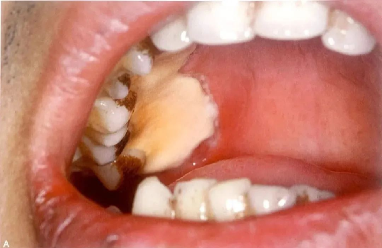
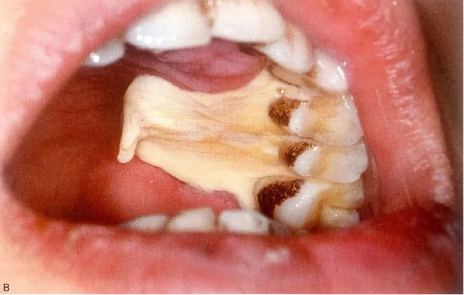
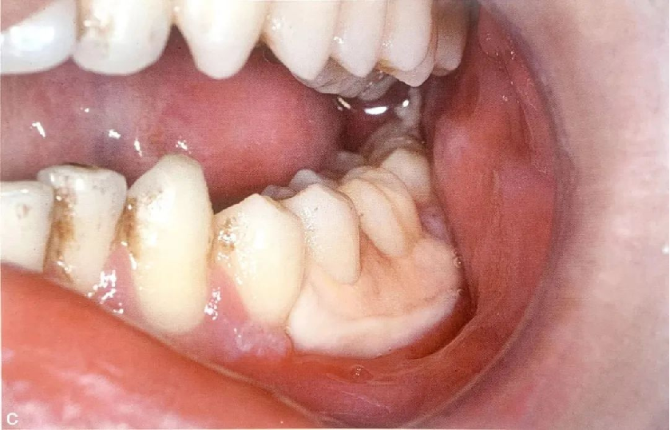

##  课件下载

[ <a href='chap05.pptx'>PPT点此下载</a>]

## 口腔疾病与全身疾病重点

全身系统性疾病在口腔的表现

（一）白血病

各型白血病都可以出现口腔表现，且最容易侵犯的是牙龈组织，其症状以急性型更为明显，故有不少病案是由口腔科医师早期诊断，或者是患者接受拔牙、洁刮治术后出血不止而进一步确诊。
1.牙龈增生、肿大  由于白细胞浸润造成牙龈极度增生，增生高度可接近咬合面，而且外形不整齐，质地松软。
2.牙龈及口腔黏膜出血  检查时可见龈缘有凝血块，口腔黏膜形成瘀点、瘀斑或血肿等
3.牙龈坏死
4.牙痛、牙松动
5.淋巴结肿大

病例一  急性单核细胞白血病

基本信息  患者男性，22岁。
主诉  口腔“长疱”3天。
现病史  3天前无明显诱因出现口腔黏膜“长疱”，继之溃烂疼痛。8天前曾出现“高热” (39.8°)，于当地医院“抗感染治疗”（具体不详），2天后退热。近5天未大便。平素体质佳，二便正常。否认系统性疾病史及药物过敏史。
口内检查  后牙颊腭（舌）侧牙龈黏膜大面积坏死溃疡，并延展至硬腭黏膜，上覆较厚光滑黄白色假膜，周围黏膜色泽形态正常（图1）。

图1  口内可见后牙腭侧牙龈黏膜大面积坏死溃疡，并延展至硬腭黏膜，溃疡均被覆较厚光滑黄白色假膜，周围黏膜色泽形态正常，后牙颊侧黏膜大面积坏死溃疡，被覆较厚光滑黄白色假膜

初步诊断  牙龈溃疡。

进一步检查

① 血常规示红细胞、血红蛋白、血小板正常；白细胞正常，但分类比例异常：中性分叶核粒细胞百分率2.0%（50%~70%），单核细胞百分率10%（2%~8%），异常细胞44%。

② HIV抗体（-），梅毒血清学检测（-）。

③ 骨髓穿刺和细胞免疫分型检验显示为急性单核细胞白血病（AML-M5）。

修正诊断  急性单核细胞白血病的口腔表征。

治疗① 药物治疗：复方氯己定溶液300ml×1支 sig.含漱 t.i.d；

② 转入血液科治疗。

（二）贫血

1.缺铁性贫血：口腔黏膜苍白，舌面丝状乳头及菌状乳头萎缩，舌面光滑发亮，舌尖可见萎缩性改变，唇、颊及舌黏膜受刺激或炎症激惹，可形成溃疡。黏膜和舌有烧灼痛，口角有炎症或皲裂。
2.巨幼细胞贫血：早期的口腔症状表现为疼痛性舌炎和舌的烧灼感。继之舌部出现溃疡，舌乳头萎缩，舌色亮红，呈火样斑块，尤以舌缘和舌尖明显。严重者舌面光滑，呈蜡片状，舌部肌张力丧失。不少患者出现戴义齿困难而又不能以义齿制作不良来解释。
3.再生不良性贫血：口腔黏膜苍白，牙龈小量持续出血，黏膜及皮肤出血有瘀点、淤斑轻微的创伤即可引起溃疡和坏死，常见于牙龈缘、颊黏膜和硬㬽。不少患者伴发扁桃体炎和咽炎。

1.出血性疾病包括血小板减少性紫癜、血友病等。可由多种原因诱发口腔出血
主要口腔表征为，明显的出血倾向，可由刷牙、啃咬食物、咬破黏膜以及磕碰外伤所引起。要强调指出的是，任何口腔颌面部手术，如拔牙、牙髓手术等均可发生严重出血。口腔创伤愈合延迟。
2.出血性疾病病人口腔治疗注意事项
对明确诊断的患者禁忌口腔手术。

牙周炎与糖尿病相互影响

从发病机制上看，糖尿病的一个重要原因是胰岛素抵抗。近些年研究表明，炎症因子与胰岛素抵抗之间有着密切关系。慢性牙周炎患者血清中的炎症因子会升高，而这些炎症因子会降低胰岛素的敏感性。从临床治疗上看，通过牙周治疗，能够显著降低伴有牙周炎的糖尿病患者的血糖和糖化血红蛋白水平。此外，临床观察发现，伴有牙周炎的糖尿病患者比牙周健康的糖尿病患者更易发生全身并发症。

糖尿病已是牙周炎公认的危险因素之一，调查发现，糖尿病患者患牙周炎的风险是血糖正常者的2.1～3.0倍。这是由于长期高血糖作用下，糖尿病患者的牙周组织抗感染能力减弱、伤口愈合能力下降；而且，糖尿病患者的糖化末端产物升高，刺激炎症细胞因子产生，这些炎症介质又能激活破骨细胞和胶原酶，加重牙槽骨及牙周软组织破坏程度。

牙周炎和糖尿病存在双向关系，一方面糖尿病可能会引发或加重牙周炎的敏感性和严重程度，另一方面牙周炎也可能会引发或加重糖尿病的严重程度，甚至造成血糖控制不良。目前很多研究表明牙周炎是糖尿病的第六大并发症，所以糖尿病患者要更加注意口腔保健，掌握正确的刷牙方法，一旦患有牙周炎要积极治疗。