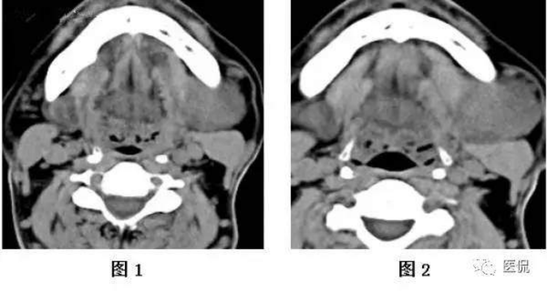
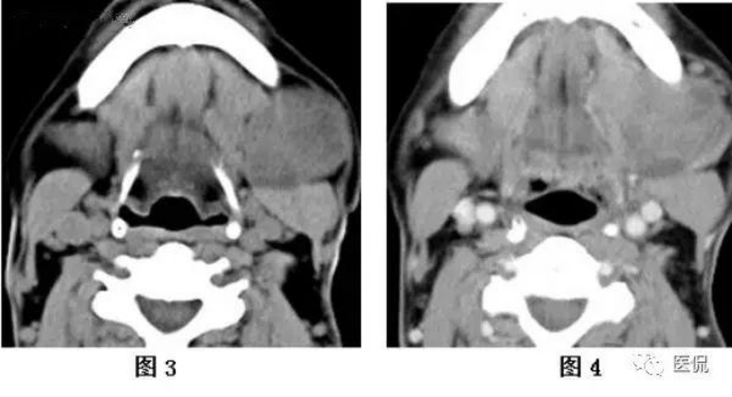
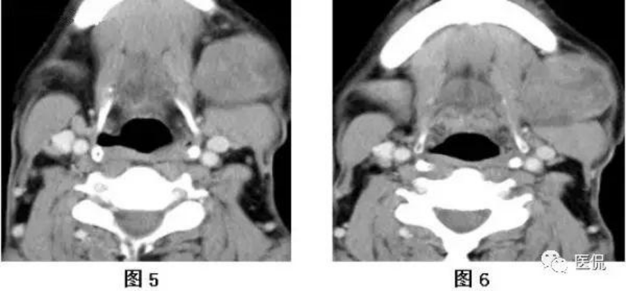
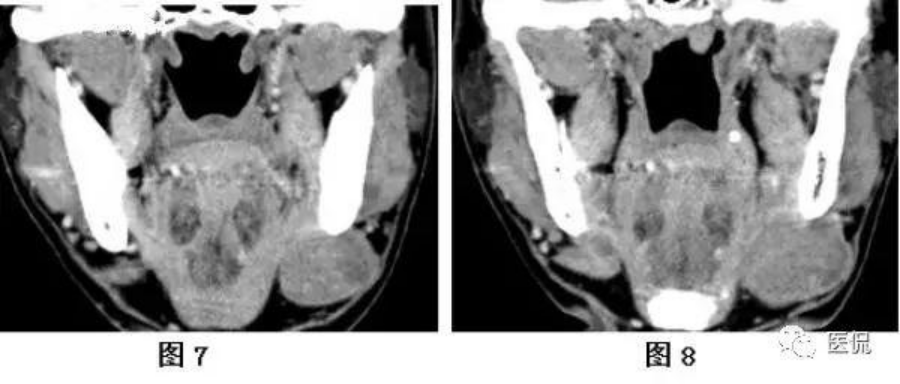
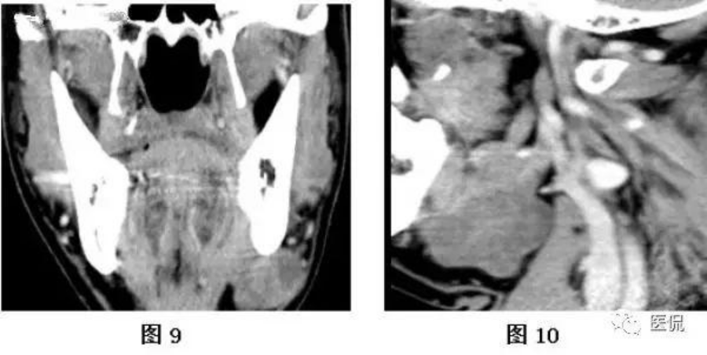

##  课件下载

[ <a href='chap06.pptx'>PPT点此下载</a>]

## 唾液腺常见疾病重点

 **一、唾液腺炎症**

|                        | 病因病理                                                     | 临床表现                                                     | 诊断和鉴别诊断                                               |
| ---------------------- | :----------------------------------------------------------- | :----------------------------------------------------------- | ------------------------------------------------------------ |
| **急性化脓性腮腺炎**   | 唾液分泌减少，金黄色葡萄球菌                                 | **早期，单侧****轻微疼痛、肿大、压痛**化脓坏死期，疼痛加剧，持续性疼痛或跳痛，耳垂为中心肿胀明显，伴发蜂窝织炎，皮肤发红、水肿，硬性浸润，触痛明显。腮腺导管开口红肿，可见**脓液溢出** | 不宜做腮腺造影1、流行性腮腺炎，儿童，传染接触史，双侧，无红肿，无脓液，急性期淀粉酶升高2、咬肌间隙感染，牙源性感染，阻生齿冠周炎，无红肿，分泌清亮 |
| **慢性复发性腮腺炎**   | 1、先天性发育异常2、免疫功能低下3、细菌逆行感染              | 5岁最为常见，男性多于女性。轻度水肿，皮肤潮红，个别表现为腮腺肿块，炎性浸润性基牙可见有脓液或胶冻状液体。持续1周左右，反复发作，年龄越大间隔越长 | 临床表现+腮腺造影1、流行性腮腺炎，双侧，发热、肿胀明显，无反复感染史2、舍格伦综合征，中年女性，无自幼发病史，口干、眼干，主导管扩张不整，**边缘毛糙，葱皮样或花边样改变** |
| **慢性阻塞性腮腺炎**   | 局部原因导管口黏膜被咬破，瘢痕愈合后引起导管口狭窄导管结石或异物 | 男性多于女性，中年，单侧（多）腮腺反复肿胀，进食肿胀每月一次，轻微疼痛唾液分泌增加、粘稠按摩后有“咸味”液体流出，随之局部感到轻快 | 临床表现+腮腺造影基牙腺体，流出混浊液体**主导管、叶间、小叶间**导管部分狭窄、部分扩张，腊肠样改变，部分有**点状扩张**1、成人复发性腮腺炎 叶间、小叶间无变化2、舍格伦综合征继发感染 未见点、求状扩张 |
| **涎石病和下颌下腺炎** | **涎石病是在腺体或导管内发生钙化性团块而引起的一系列病变。85%下颌下腺，其次是腮腺，涎石使唾液排出受阻，激发感染，造成腺体急性、反复发作的炎症** | 20-40中年青年多见①进食时腺体肿大，自觉肿胀疼痛，距离呈针刺样“涎绞痛”，伴同侧舌、舌尖痛，放射至耳颞、颈部②导管口黏膜红肿，挤压可见脓性分泌物③导管内涎石，双手触诊触及硬块，并有压痛，黏膜下有炎性浸润④阻塞引起腺体继发感染，反复发作 | 进食时肿胀疼痛的特点，导管口溢脓，双手触诊解释+X线摄片1、舌下腺肿瘤，无导管阻塞症状，X线检查无阳性结石2、下颌下腺肿瘤，进行性肿大，无进食肿大及炎症3、慢性硬化性下颌下腺炎4、下颌下淋巴结炎，反复肿大，与进食无关，分泌正常5、下颌下间隙感染，牙痛史，皮肤潮红，凹陷性水肿 |

 

**二、舍格伦综合征**

**是一种自身免疫性疾病，特征表现为外分泌腺的进行性破坏，导致黏膜及结膜干燥，并伴有各种自身免疫性病征。**病变限于外分泌腺本身者，称为原发性。同时伴有其他自身免疫性疾病，如类风湿关节炎等，称为继发性。

临床表现 多见于中年以上女性 主要症状为**眼干、口干、唾液腺及泪腺肿大、类风湿性关节炎等结缔组织疾病**

**1、眼部表现 2、口腔表现 3、唾液腺肿大 4、其他外分泌腺受累的表现 5、结缔组织疾病 6、其他合并症**

​     诊断

​    1、施墨试验 2、四碘四氯荧光素染色 3、唾液流量测定 4、唾液腺造影或磁共振唾液腺造

影片MRS 5、放射性核素功能测定 6、实验室检查 7、唇腺活检

 治疗

尚无有效的根治方法，主要为对症治疗。对于结节型可采用手术治疗，切除受累腺体，防止恶性变。单发性，腺体破坏严重或继发感染明显者，也可考虑手术切除。一般呈良性过程，极少恶变。 

 

**三、唾液腺瘤样病变、唾液腺肿瘤**

|                    | 临床表现                                                     | 治疗预防                                                     |
| ------------------ | ------------------------------------------------------------ | ------------------------------------------------------------ |
| **唾液腺粘液囊肿** | 粘液囊肿 半透明、**浅蓝色**的小泡，黄豆、樱桃大小、质地软有弹性，流出**蛋清样透明粘稠液体**。反复破损后表现为较厚的白色瘢痕状突起，透明度减低舌下腺囊肿 多见于青少年1、单纯型 浅紫蓝色，有波动感。粘稠而略带黄色或**蛋清样液体**2、口外型 浅突型 下颌下区肿物，穿刺可抽出**蛋清样粘稠液体**3、哑铃型 | 1、小唾液腺黏液囊肿 抽尽囊液后，注入2%碘酊2-3m再抽出，也可注射20%氯化钠，常用手术切除2、舌下腺囊肿 切除 |
| **多形性腺瘤**     | 生长缓慢，常无自觉症状，病史较长。肿瘤界限清楚，质地中等，扪诊呈结节状，高起处常较软，可有囊性变，低凹处较硬，多为实质性组织。位于硬腭部、下颌后区固定不可动，一般可活动 | 手术切除，不能做剜除术，肿瘤包膜外正常组织处切除。保留面神经，下颌下腺瘤应包括下颌下腺一并切除 |
| **沃辛瘤**         | 1、多见于男性2、好发年龄在40-70岁中老年3、常有吸烟史4、可有消长史5、多位于腮腺后下极6、圆形或卵圆形，表面光滑，质地软，有弹性感觉7、多发性8、术中肿瘤呈紫褐色，剖面囊腔形成，内含干酪样或粘稠液体9、99mTc核素呈热结节，具有特征性 | 手术切除为主，可考虑连同肿瘤以及周围0.5cm以上正常腮腺切除    |
| **粘液表皮样癌**   | 女性多于男性，腮腺好发，其次是腭和下颌下腺，其他小唾液腺，磨牙后腺高分化：无痛性肿块、生长缓慢大小不等，边界可清或不清，质地中等偏硬，表面结节状。腭部和磨牙后区的课呈囊性，表面黏膜呈浅蓝色。低分化：生长快、有疼痛，边界不清，与周围组织粘连，常累及面神经，淋巴结转移率高，可出血行转移。 | 高分化癌手术切除不彻底可复发，少发生颈淋巴结转移，血行转移更少见，术后生存率高，预后好。不用做术后放疗及颈淋巴清扫低分化癌术后易复发，预后差低分化者宜用术后放疗，可以考虑选择性淋巴清扫术分离后的神经可用液氮冷冻及术后放疗 |
| **腺样囊性癌**     | 1、肿瘤易沿神经扩散，常有神经症状，疼痛、面瘫、舌麻木、舌下神经麻痹2、肿瘤浸润性极强3、易侵入血管，造成血行性转移，肺转移多见4、颈淋巴结转移率很低5、沿骨髓腔浸润，X片上无明显骨质破坏，不能根据有无骨质破坏来判断颌骨被肿瘤侵犯与否6、单纯放疗不能达到根治7、出了实性型外，一般生长缓慢，即使出现肺转移，如果原发灶得以根治，仍可考虑行原发灶手术治疗。 | 手术设计常规扩大手术正常周界，术中宜作冰冻切片检查，以确定周界是否正常术后可采用化疗，以预防血行转移一般不考虑颈淋巴结清扫，位于舌根部的淋巴转移率高，可以考虑行选择性颈淋巴结清扫术配合术后放疗科明显降低术后复发率 |

## 唾液腺常见疾病案例分析

#### 一、理论基础

口腔颌面部肿瘤的患病率与全身其它部位相比并不算高，由于有瘤样病变归属于良性肿瘤中，所以一般说良性肿瘤多于恶性肿瘤。从组织来源讲，无论是良性肿瘤还是恶性肿瘤多数来自 上皮组织。良性肿瘤肿牙源性的较多，恶性肿瘤中以**鳞状细胞癌**最多 。发病部位:**舌癌**最多，其次是颊癌。有关口腔癌的诊断和治疗方法发展很快，目前有大量的研究集中于此，有分子生物学方面的，基因方面的等等。 尽管如此，临床上对于如何正确、早期诊断肿瘤，正确治疗肿瘤仍有许多问题。

#### 二、典型病例分析

**病例（左颌下腺肿物）多形性腺瘤1例**

**一、患者信息及影像**

**患者：**男性，50岁。

**主诉 :**发现左[颌下肿物](http://www.yidianzixun.com/channel/w/颌下肿物)3年余，增大6月余。

**现病史：**3年前发现左颌下肿物，无疼痛，始较小，约[花生](http://www.yidianzixun.com/channel/w/花生)米粒大小，无任何不适故不予以注意，未就诊治疗。曾自服及自敷[中药](http://www.yidianzixun.com/channel/w/中药)治疗，效果不佳。患者6月前发现肿物逐渐增大，于5天前就诊于当地医院，诊断为左颌下肿物性质待查（[混合瘤](http://www.yidianzixun.com/channel/w/混合瘤)？），现来诊要求手术入院。患者自发病以来，精神、食欲及[睡眠](http://www.yidianzixun.com/channel/w/睡眠)好，体重无明显变化。

**既往史：**既往有[甲亢](http://www.yidianzixun.com/channel/w/甲亢)病史26年，服用碘131治疗，已口服药物治愈。

**实验室检查：**血常规正常，甲功正常；肿瘤标志物未查。

**超声：**左侧[颌下腺](http://www.yidianzixun.com/channel/w/颌下腺)探及一3.7cm×3.0cm欠规则团块回声想，边界清，内回声低，欠均匀，后方回声略强；余左侧颌下腺组织回声均匀；右颌下腺大小形态正常，回声均匀。左侧颌下腺团块内探及丰富条索状彩色血流信号，色彩明亮，右侧颌下腺血流信号未见异常。

**CT/MRI扫描：**颈部CT检查：患者采取仰卧位，头稍后仰，两肩下拉。扫描范围自颅底至胸腔入口，常规扫描层厚为5mm、层间距0mm，电压120kV，矩阵512×512；如图1-4。如图1-6。

 

 

 

 

 

**二、病例问答挑战**

**问题1：**在提供的CT平扫+增强图像上，关于病灶的描述，下列正确的是（单选）

A 病灶边界清晰，密度均匀；

B 病灶边界清晰，密度不均；

C 病灶边界不清，密度不均匀；

D 病灶边界不清，密度均匀；

答案分割线

**问题一解读**

**答案：B**

该 病例平扫时密度稍低于周围软组织，与右侧软组织看似分界不清，但从增强扫描来看，病灶与周围组织界限清楚，因此C、D答案可以排除。另外，病灶平扫时密度较低，病灶密度是否均匀显示欠清，增强后呈不均匀强化，因此B答案正确。如图1-9。

**问题2：**该病例在CT扫描基础上，下列哪项检查和技术更能提供定位、定性信息（单选）

A 颈部正侧位DR拍片

B 放射线核素检查

C 颈部MRI平扫

D 颈部CT增强加后处理重建

答案分割线

**问题二解读**

**答案：C**

该患者在行CT平扫加增强后后，MRI可以更好地显示病灶与周边结构的关系。

**问题3：**根据以上临床资料与CT表现特点，该病例最可能的诊断为下列哪一项（单选）

A 颌下腺癌

B 颌下腺慢性炎症

C 颌下腺多形性腺瘤（混合瘤）

D 颌下腺淋巴瘤

答案分割线

**问题三解读**

**答案：C**

**手术所见：**左颌下腺见4cm×4cm×3cm质硬肿物，切面呈灰白色，完整切除。

**病理所见：**（左[颌下肿物](http://www.yidianzixun.com/channel/w/颌下肿物)）带颌下腺结节一个，其中结节大小4 cm×3.5 cm×3.5cm，包膜完整，切面灰白质中，稍呈粘液状，边界清楚，未见侵犯周围组织。周围颌下腺组织大小3.5 cm×2.5 cm×2cm，未见肿物侵犯。免疫组化未做（如图10-11）。

**病理诊断：**（左[颌下腺肿物](http://www.yidianzixun.com/channel/w/颌下腺肿物)）多形性腺瘤。

**三、诊断分析思路**

1本病例影像学表现提示的诊断线索

CT平扫可见左侧颌下腺区见一类圆形低及稍低混杂密度肿物影，较大截面约3.4 cm×3.8cm，边缘尚清晰，正常颌下腺未显示。肿物与左侧下颌舌骨肌、舌骨舌肌分界欠清，与左侧[胸锁乳突肌](http://www.yidianzixun.com/channel/w/胸锁乳突肌)分界尚清。CT增强后，肿物不均匀强化，其内可见片状低密度无强化区，双侧颈部I、II见多发肿大淋巴结影，较大者位于I区，大小约0.7 cm×1.3cm。从上述征象来看，左侧颌下腺区占位，边界清，结合病史时间为3年，可暂考虑为良性病变可能性大，但短期内有增大，因此，暂不能排除恶性可能。

2本病例的读片思路

**（１）发现病变与认证：**本病例临床触诊易于发现，但进一步确诊定位定性CT平扫加增强扫描十分必要，一是易于显示病灶位置、形态、大小及与周边结构的关系，二是有助于判定病灶的血液供应情况。本病例基本征象为类圆形、边缘尚清晰、密度不均匀和轻中度不均匀强化占位性病灶。

**（２）定位诊断：**定位诊断的含义，一是确定病灶位于什么部位，二是明确病灶可能来源于什么组织结构。对于本病例来说，病灶位于左侧颌下腺，正常左侧颌下腺消失，左侧下颌舌骨肌、舌骨舌肌，胸锁乳突肌受压，定位诊断问题不大。

**（３）定性诊断：**本病例特点为临床上50岁中年男性，因发现左侧[颌下腺肿物](http://www.yidianzixun.com/channel/w/颌下腺肿物)3年入院，CT平扫上病灶与周围组织分界欠清，增强呈不均匀强化， 从征象及临床病史来看，主要现为良性征象，但短期内有增大，因此，暂不能排除恶性及其他性质病变可能。

**四、诊断与鉴别诊断**

1诊断要点

本病例的特点为中年男性患者，病史较长，临床症状不明显。CT上左侧下颌下腺区见一类圆形低及稍低混杂密度肿物影，较大截面约3.4 cm×3.8cm，边缘尚清晰，肿物与左侧下颌舌骨肌、舌骨舌肌分界不清，与左侧胸锁乳突肌分界尚清。CT增强后，肿物不均匀强化，其内可见片状低密度无强化区。患者年龄病史符合多形性腺瘤的特点（30～50岁，病史长），病灶小于5mm，因此，诊断为多形性腺瘤，但从影像上观察灶病变组织与正常颌下腺组织分界不清等特点，短期内有增大病史，该病例还是不能排除混合瘤恶变可能。

2诊断难点

病变大，病史不典型，超声方面容易与滤泡性病变混淆，而CT方面易于[甲状腺](http://www.yidianzixun.com/channel/w/甲状腺)乳头状癌混淆。

3鉴别诊断

**（1）颌下腺慢性炎症：**也可表现为无痛性肿块，但常有感染来源，如面部、口腔或咽部的炎症。肿块常为多个，有时大时小的消长史，抗感染治疗常可奏效。

**（2）颌下腺癌：**恶性肿瘤以多种不同来源的癌多见，形态不规整，边缘模糊，可伴同侧颈深筋膜，增厚，密度不均匀，增强后呈不均匀轻至中度强化，易侵犯邻近结构，伴有同侧颈淋巴结肿大。文献表明，呈低分化的黏液表皮样癌及呈高度恶性的腺样囊性癌，由于其边缘浸润严重，常难与腺体周围正常组织区分，且CT平扫时肿块密度较低，增强后密度明显不均，伴多发不规则小囊状低密度区，较具特征性性。

**专家点评**

该例病变的定位很重要，病变位于左侧颌下区，主要需要明确病变来源于颌下腺还是推压颌下腺，正常颌下腺的显示对于判断病变非常关键。该病变与左侧颌下腺边界不清，正常颌下腺未显示，提示病变的来源。MRI可以更加清晰显示病变的来源，病变与邻近舌下腺，[胸锁乳突肌](http://www.yidianzixun.com/channel/w/胸锁乳突肌)的关系。定位之后，观察病变的特征，病变边界清晰，但是内部密度不均匀，增强检查可见肿物不均匀强化，其内可见片状低密度无强化区。颌下腺的肿物中，良性、恶性的发生率各占50%，病变的判断主要根据病变的特征。 该病人双侧颈部I、II区见多发肿大淋巴结影，较大者位于I区，大小约0.7 cm×1.3cm，但是淋巴结密度均匀，可见淋巴结门，因而淋巴结考虑良性病变。从上述征象来看，左侧颌下腺区占位，边界清，结合病史时间为3年，可暂考虑为良性病变可能性大，但短期内有增大，因此，暂不能排除恶性可能。

**参考文献：**

[1]邝平定, 俞炎平, 邵国良, et al. 颌下腺良恶性病变的CT表现分析 [J]. 中华放射学杂志, 2011, 45(12): 1181-4.

[2]黄银平, 沈比先, 贾飞鸽, et al. 颌下腺[混合瘤](http://www.yidianzixun.com/channel/w/混合瘤)的CT表现 [J]. 放射学实践, 2010, 25(5): 501-3.

[3]董宝明, 强永乾, 张蕾, et al. 颌下腺肿瘤CT诊断和鉴别诊断 [J]. 中华消化病与影像杂志（电子版）, 2013, 3(6): 280-3.

[4]丁莹莹, 李鹍, 高德培. [颌下腺](http://www.yidianzixun.com/channel/w/颌下腺)肿瘤的CT诊断 [J]. 实用放射学杂志, 2005, 21(6): 589-91.

[5]Wilson T C, Ma D, Tilak A, et al. Next-Generation Sequencing in Salivary Gland Basal Cell Adenocarcinoma and Basal Cell Adenoma [J]. Head and neck pathology, 2016, 10(4): 494-500.

[6]Gao M, Hao Y, Huang M X, et al. Salivary gland tumours in a northern Chinese population: a 50-year retrospective study of 7190 cases [J]. International journal of oral and maxillofacial surgery, 2016.

 