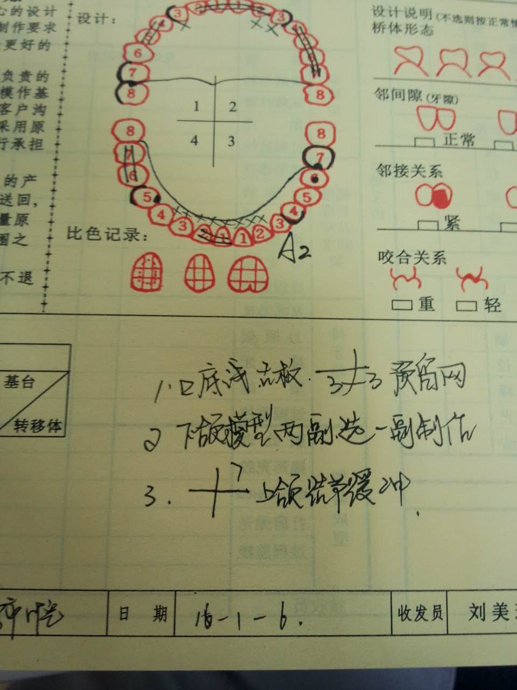

##  课件下载

[ <a href='chap06.pptx'>PPT点此下载</a>]

## 牙体缺损，牙列缺损/缺失的修复重点

### 第一节 牙体缺损修复 

一、牙体缺损的病因 

龋病、牙外伤 、磨损、锲状缺损、酸蚀症 、发育畸形 

二、牙体缺损的影响 

牙本质敏感 、 牙髓症状 、牙周症状、 咬合症状 、其他不良影响

三、牙体缺损的修复原则   

（一）正确地恢复形态与功能  

（二）牙体预备过程中注意保护软硬组织健康 

四、牙体缺损修复体的种类

嵌体 、部分冠 、贴面 、全冠 、桩核冠 、暂时性修复体 

### 第二节 牙列缺损的固定局部义齿修复

一、牙列缺损及牙列缺失的病因和影响

牙列缺损(dentition defect)是指单颌或上下颌牙列中部分自然牙的缺失。

牙列缺失(edentulous)是指单颌或上下颌整个牙列的缺失，牙列缺失患者的上下颌称为无牙 。

牙列缺损或缺失后如不及时修复，可给患者带来局部和全身的影响表现为:缺隙两侧的邻牙倾斜移位，对颌牙伸长，出现牙间隙、局部咬合紊乱甚至牙周创伤,咀嚼功能减退或丧失,影响发音，咬合，尤其是前牙缺失,影响外貌美观,长期、多个后牙缺失且久未修复可引发颞下颌关节功能紊乱。

二、固定义齿

固定义齿(fixed prosthesis)是利用缺失牙间隙两端或一端的天然牙或牙根作为基牙，在其上制作固位体，并与人工牙连接成为一个整体，借黏固剂黏固于基牙上，患者不能自行摘戴的修复体。由于其基本结构与一般桥梁的结构类似又称固定桥(fixed bridge)。

### 第三节 牙列缺损的可摘局部义齿修复

可摘局部义齿是一种患者可以自行摘戴的用于部分牙缺失（牙列缺损）的修复体。义齿主要通过固定在余留天然牙上的卡环等固位装置和基托保持义齿在牙列中的位置，利用天然牙和缺牙区剩余牙槽嵴做支持，恢复缺失牙及其周围缺损组织的解剖形态和生理功能。 

### 第四节 牙列缺失的全口义齿修复

全口义齿是对无牙颌患者的常规修复治疗方法。全口义齿是采用人工材料替代缺失的上颌或下颌完整牙列及相关组织的可摘义齿修复体。

全口义齿由人工牙（Artificial Teeth）和基托（Denture Base）两部分组成，靠义齿基托与无牙颌黏膜组织紧密贴合及边缘封闭产生的吸附力和大气压力，使义齿吸附在上下颌牙槽嵴上，恢复患者的缺损组织和面部外观，恢复咀嚼和发音功能，义齿基托覆盖下的黏骨膜和骨组织承担义齿的咬合压力。

## 牙体缺损，牙列缺损/缺失的修复病例介绍

一、病史

王长滨 男 46 汉族
主诉:上颌前牙拔出后要求修复
现病史:患者一月前于齿槽外门诊拔出上颌前牙现来我科要求修复
既往史:体健，否认系统疾病药物及金属过敏
临床检查:11、12、14、15、21、22、24、25、26、27、36、41、42、46、47缺失，缺牙区牙槽脊平整，未触及骨尖骨突，缺牙区临牙无倾斜松动移位，对合牙未见伸长，合间距离正常。17选中颈部见一龋坏，穿髓，冷热无反应，松动I度，X线:17暗影至髓腔，根尖可见低密度影像
诊断:1.11、12、21、22、36、46、47缺失；2.17根尖炎，
治疗计划:1.转内科治疗17；2.择期修复；
治疗:告知患者病情及治疗计划，今转科治疗

复诊:预约镶牙

检查:17暂封物在，扣(-)，松(-)，X线:17根充可，根尖无暗影；

诊断:17牙体缺损

治疗计划:1.活动义齿修复缺失牙；2.17桩+充填修复处理:详细向患者交代病情及修复种类，患者自愿选择BPD可摘局部义齿修复，今在患者知情同意下，17去暂封，制备桩道，置入1.3mm纤维桩+unicem粘结，树脂恢复牙体外形，调合抛光；预备合支托窝，取模，记录合位关系，比色A2两周后试牙，不适随诊。

二、理论基础

可摘局部义齿是由患者能自行摘戴的义齿，是牙列缺损后的一种主要修复方式。它是利用缺牙区的邻牙或其它余留牙齿，牙槽嵴和粘膜作支持，借助义齿上的卡环（即金属钩）和基托的作用，使义齿能在患者口腔内获得固位，患者自己可以摘戴。 

三、治疗

可摘局部义齿设计：根据患者口腔余留牙、缺牙区、口腔内软组织、牙槽骨高度等情况填写设计单，画设计图。

## 口腔粘膜疾病重点

### 1、复发性阿弗他溃疡

1）阿弗他溃疡是指疼痛而原因不明的口腔浅表性溃疡, 有周期性、复发性及自限性的特点。

2）轻型阿弗他溃疡临床特点：溃疡、疼痛、自限、 复发

3）分型：轻型：红、黄、凹、痛

重型：大而深，似弹坑

疱疹样：满天星

### 2、口腔单纯性疱疹

原发性临床特点：全身不适、黏膜充血、成簇小疱、破溃糜烂。

复发性临床特点：成簇小疱、原位复发。

### 3、口腔念珠菌病

临床表现：色如白雪、质似丝绒。

### 4、急性坏死性龈口炎

临床表现：刀削性坏死、自发性出血。

特点：坏死、疼痛、腥臭、出血。

### 4、扁平苔癣

临床表现：珠光色条纹。网状损害、丘疹、斑块、糜烂。

### 5、口腔白斑病

属于癌前病变。

四种临床形态：斑块状、皱纸状、颗粒状、疣状

### 6、原发性疱疹性口炎

分期：前驱期、水疱期、糜烂期、愈合期

## 口腔粘膜疾病病例分析

患者，男，3个月。

主诉(母亲代诉)患儿口内起白点、斑片3 d。

现病史l周前患儿感冒、发热、哭闹不安。服抗感冒药后，症状有所好转。3 d前．发现口腔内有散在白色小点，渐增多呈片状。患儿烦躁，拒食。

检查口内双侧颊黏膜，舌腹充血，上有凝乳状白色斑点，针尖大小。同时颊、唇区域呈形状不规则的白色斑片，用棉签用力拭擦，白色斑片可脱落，遗留溢血的剖面。

实验室检查  取白色斑片涂片镜检可见大量假菌丝、芽孢。培养：培养基上形成厚壁孢子。

诊断  急性假膜型念珠菌性口炎(雪口病)。

2诊断依据

(1)发病多见于婴幼儿。

(2)起病急，充血的口腔黏膜上出现色白如雪、针尖大小的斑点，融合成块如奶酪的白色斑片，蔓延可遍及整个口腔，状如铺雪，故名雪口病。

(3)斑片与其下面黏膜附着较紧．用力可擦掉．露出其下滥血创面。

(4)患儿哭闹不食。

(5)假膜涂片可见假菌丝或芽孢，培养可确诊。

3．鉴别诊断

(1)白喉  ①由白喉杆菌引起的急性全身感染性疾病。②起病缓慢，轻度或中度发热。

③全身中毒症状明冠，尤其是心肌损害和周围神经麻痹；局部淋巴结肿大。④局部病损主要为灰白色假膜覆盖于扁桃体上，界限清楚。⑤涂片镜检和培养可见病原菌。

(2)球菌性口炎  ①由金黄色葡萄球菌、溶血性链球菌，肺炎双球菌等感染    引起。②口内病损为致密而光滑的假膜．呈灰白或黄褐色。③直接涂片镜检可见大量球菌．细菌培养可确定主要病原菌。

4．治疗

（1)局部弱碱性液含漱或涂布：2％～4％NaHC03溶液；0.05％龙胆紫水溶液。

(2)局部含化或涂擦抗真菌药物，如制霉菌素5万-10万u/ml水混悬液涂擦患处．或50u含化，每日3-4次。克霉唑0.25g，含化等。

（3）患儿奶具和餐具应煮沸消毒，并置弱碱性液中浸泡。

（4）哺乳前后母亲应用弱碱性液清洗乳头。