##  课件下载

[ <a href='chap08.pptx'>PPT点此下载</a>]

## 口腔卫生保健重点

###  第一节 口腔卫生

口腔卫生与口腔疾病的发生有很大关系，特别是牙周病和龋病。保持口腔卫生的方法有：漱口、刷牙、牙间洁净、牙龈按摩、消除食物嵌塞和刮除牙结石（龈上洁治术和龈下刮治术）等。其中以刷牙最为重要。

（1）刷牙的作用

刷牙能去除口腔污物、菌斑和按摩牙龈，从而减少口腔环境中的致病因素，增强牙周组织的防御能力。

（2）刷牙的方法

改良Bass刷牙法(成人）

a、将刷头置于牙颈部，刷毛指向牙根方向（上颌牙向上，下颌牙向下），刷毛与牙长轴大约成45°角，轻微加压，使刷毛部分进入牙龈沟，部分置于牙龈上。

b、从后牙颊侧以2-3颗牙为一组开始，用短距离水平颤动的动作数次刷牙，然后将牙刷向牙冠方向转动，拂刷牙面。刷完第一个部位后，将牙刷移至下一组2-3颗牙的位置重新放置，注意与前一个部位保持有重叠的区域，继续刷下一个部位，按顺序刷完上下牙的牙面。

c、用同样的方法刷后牙的内侧。

d、刷上前牙内侧时，将刷头竖放在牙面上，使前部刷毛接触龈缘，自上而下拂刷。刷下前牙舌面时，自下而上拂刷。

e、刷咬合面时，刷毛指向咬合面，稍用力作前后来回刷。

圆弧刷牙法（2-6岁儿童）

a、“牙齿外面圆弧刷”：刷毛轻轻接触牙齿外侧，从最后一颗牙齿与牙龈的交界处开始，以圆弧状的拂动轨迹边刷边向前移动，从上颌牙龈刷到下颌牙龈，再从下颌牙龈到上颌牙龈。刷前牙外侧时，可将下颌微微前伸使上下牙列齿缘相对，依旧用画圆弧动作清理。对侧重复。外侧：在上下牙龈之间画圆弧向前。

b、“牙齿里面颤动刷”：从最后面一颗牙开始，刷柄平行牙龈缘，手持牙刷边小幅度往返颤动边向前移动。刷前牙内侧时，要将牙刷竖起，使用顶端刷毛上下震颤刷动。对侧重复。内侧：后牙前后颤刷，前牙上下颤刷。

c、“咬合面是来回刷”：清洁牙齿咬合面需要使用更大的摩擦力度。刷头对准窝沟，前后往返刷动，才能除掉存留在窝沟内的食物残渣。

（3）刷牙要求

将全口牙齿按上下左右分成若干区，依次洗刷，颊面、舌面、面都要刷到，并重复刷洗。刷牙次数，一般要求早晚刷牙，饭后漱口，每次刷牙可不少于2min。最好每次饭后也刷。

（4）牙刷的选择

牙刷种类：牙刷种类很多，为适应垂直颤动法，我国1975年决定推广保健牙刷。其特点是：头小，能灵活旋转，适于分区洗刷；刷毛排列合理，有利于清除牙菌斑，又使牙刷本身容易清洗；刷毛较软，刷毛长度适当，刷毛顶端圆钝，以防刺伤和擦伤牙龈；刷柄长度、宽度适中，防滑设计，握持方便。

另外，国内外还设计了一些有特殊功能的新型牙刷。如电动牙刷。

刷毛硬度，一般认为软毛牙刷柔韧易弯曲，能进入龈缘下、邻面清除菌斑，但对厚的菌斑不能完全去除。

刷毛顶端设计，毛尖磨圆易于进入龈沟起清洁作用，与平切形相比，对牙体牙龈损伤较小。

如何选择牙刷，应根据个人口腔情况，选择大小、形态、刷毛软硬适度的牙刷，病人应在医生指导下选择。

（5）牙膏

目前我国使用的牙膏分普通牙膏，含氟牙膏、药物牙膏三大类。牙膏主要成分有洁净剂、摩擦剂、胶粘剂、芳香剂。含氟和药物牙膏是在以上基础上加入氟化物和一定药物，以期预防龋病和牙周病。

目前世界上牙膏生产大部分为预防、治疗性药物牙膏。但由于口腔环境特殊，存在影响药物作用的多种因素，其实际效果尚不确定。另外，如长期滥用药物牙膏，还会干扰口腔生态平衡，导致菌群失调。

###  第二节口腔保健

普通人群的口腔保健

（一）定期口腔健康检查

目的：定期保健检查，“有病早治，无病预防”。

时间：一般每半年进行一次专业的口腔检查。

（二）纠正不良习惯

（三）消除影响口腔卫生的不利因素

（四）合理营养

（五）改善劳动环境

##  牙体牙髓病重点

# 第一节　龋病（Caries）

龋病是一种由口腔中多种因素复合作用所导致的牙齿硬组织进行性病损，表现为无机质的脱矿和有机质的分解，随着病程的发展而有色泽变化到形成实质性病损的演变过程。其特点是发病率高，分布广。一般平均龋患率可在50％左右，是口腔主要的常见病，也是人类最普遍的疾病之一，世界卫生组织已将其与癌症和心血管疾病并列为人类三大重点防治疾病。

（一）病因

经过长期研究，现已基本明了，龋病是由多种因素复合作用所致，目前公认的龋病病因学说是四联因素学说（图1），主要包括细菌、口腔环境、宿主和时间，其基本点为：致龋性食物（特别是蔗糖和精制碳水化合物）在糖，紧紧贴附于牙面由涎液蛋白形成的获得性膜上，在这种由牙齿表面解剖结构和生化、生物物理特点形成的不仅得以牢固的附着于牙面，而且可以在适宜温度下，有足够的时间在菌斑深层产酸，侵蚀牙齿，使之脱矿，并进而破坏有机质，产生龋洞。

 

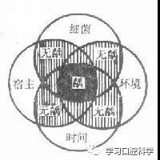

图1 四联因素论图解

1．细菌

是龋病发生的必要条件，一般认为致龋菌有两种类型，一种是产酸菌属，其中主要为变形链球菌、放线菌属和乳杆菌，可使碳水化合物分解产酸，导致牙齿无机质脱矿；另一种是革兰氏阳性球菌，可破坏有机质，经过长期作用可使牙齿形成龋洞。目前公认的主要致龋菌是变形链球菌，其它还包括放线菌属、乳杆菌等。

细菌主要是借助菌斑粘附于牙面。口腔滞留食物中的碳水化合物被降解后，一方面聚合产生高粘性葡聚糖，形成菌斑基质，另一方面产酸使牙齿脱矿，菌斑的组成比较复杂，除大量细菌外，还有糖、蛋白、酶等物质。

2．口腔环境

口腔是牙齿的外环境，与龋病的发生密切相关，其中起主导作用的主要是食物和涎液。

（1）食物主要是碳水化合物，既与菌斑基质的形成有关，也是菌斑中细菌的主要能源，细菌能利用碳水化合物（尤其是蔗糖）代谢产生酸，并合成细胞外多糖和细胞内多糖，所产的有机酸有利于产酸和耐酸菌的生长，也有利于牙体硬组织的脱矿，多糖能促进细菌在牙面的粘附和积聚，并在外源性糖缺乏时，提供能量来源。因此，碳水化合物是龋病发生的物质基础。

（2）涎液在正常情况下，涎液有以下几种作用：

机械清洗作用减少细菌的积聚。

抑菌作用直接抑菌或抑制菌斑在牙面的附着。

抗酸作用由所含重碳酸盐类等物质起中和作用。

抗溶作用通过所含钙、磷、氟等增强牙齿抗酸能力，减少溶解度。

涎液的量和质发生变化时，均可影响龋患率，临床可见，口干症或有涎液分泌的患者龋患率明显增加。颌面部放射治疗患者可因涎腺被破坏而有多个牙龋；另一方面，当涎液中乳酸量增加，或重碳酸盐含量减少时，也有利于龋的发生。

3．宿主

牙齿是龋病过程中的靶器官，牙齿的形态、矿化程度和组织结构与龋病发生有直接关系，如牙齿的窝沟处和矿化不良的牙较易患龋，而矿化程度较好、组织内含氟量适当的牙抗龋力较强；另方面，牙齿的结构与机体有密切关系，尤其是在发育中，不仅影响到牙齿的发育和结构，而且对涎液的流量、流速及其组成也有很大影响，因而也是龋病发生中的重要环节。

4．时间

龋病的发生有一个较长的过程，从初期龋到临床形成龋洞一般需1.5-2年，因此即使致龋细菌、适宜的环境和易感宿主同时存在，龋病也不会立即发生，只有上述三个因素同时存在相当长的时间，才可能产生龋坏，所以时间因素在龋病发生中具有重要意义。

（二）临床表现

1.龋病好发部位

龋病的好发部位与食物是否容易滞留有密切关系。牙齿表面一些不易得到清洁，细菌、食物残屑易于滞留的场所，菌斑积聚较多，容易导致龋病的发生，这些部位就是龋病好发部位，包括：窝沟、邻接面和牙颈部（图2）。

 

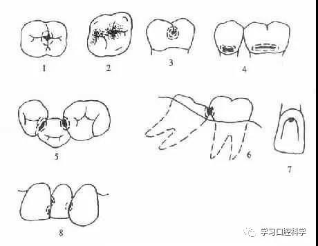

图2 龋病的好发部位

1，2后牙牙合面窝沟龋 3.磨牙颊面沟龋 4.牙颈部龋 5.后牙邻面龋

6.因阻生牙而致的邻面龋 7.前牙舌面窝龋 8.前牙邻面龋

牙齿的窝沟是牙齿发育和矿化过程中遗留的一种缺陷，也是龋病的首要发病部位，牙齿的邻接面是仅次于窝沟的龋病好发部位，一般因邻面接触面磨损或牙间乳头萎缩导致食物嵌塞所致。牙颈部是釉质与牙本质的交界部位，即利于滞留食物和细菌，也是牙体组织的一个薄弱环节，尤其是釉质与牙骨质未接触，牙本质直接外露时更容易发生龋坏。

2.龋坏程度

临床上可见龋齿有色、形、质的变化，而以质变为主，色、形变化是质变的结果，随着病程的发展，病变由釉进入牙本质，组织不断被破坏、崩解而逐渐形成龋洞，临床上常根据龋坏程度分为浅、中、深龋三个阶段，各自表现如下，（图3）

 

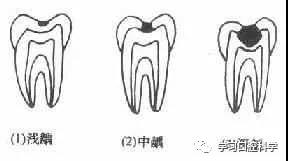

图3 龋坏程度

浅龋：亦称釉质龋，龋坏局限于釉质。初期于平滑面表现为脱矿所致的白垩色斑块，以后因着色而呈黄褐色，窝沟处则呈浸墨状弥散，一般无明显龋洞，仅探诊时有粗糙感，后期可出现局限于釉质的浅洞，无自觉症状，探诊也无反应。

中龋：龋坏已达牙本质浅层，临床检查有明显龋洞，可有探痛，对外界刺激（如冷、热、甜、酸和食物嵌入等）可出现疼痛反应，当刺激源去除后疼痛立即消失，无自发性痛。

深龋：龋坏已达牙本质深层，一般表现为大而深的龋洞，或入口小而深层有较为广泛的破坏，对外界刺激反应较中龋为重，但刺激源去除后，仍可立即止痛，无自发性痛。

龋坏在X线片上呈黑色透射区，对难以确诊者（如邻面龋），可借助X线片协助诊断。

（三）治疗

龋病治疗的目的在于终止病变过程，阻止其继续发展并恢复牙齿的固有形态和功能。由于牙齿结构特殊，虽有再矿化能力，但对实质性缺损无自身修复能力。除少数情况可用药物外，均需采用手术治疗。

1．药物治疗

药物治疗是在磨除龋坏的基础上，应用药物抑制龋病发展的方法，适用于恒牙尚未成洞的浅龋，乳前牙的浅、中龋洞。常用药物包括氨硝酸银和氟化钠等。

2．充填术

对已形成实质性缺损的牙齿，充填术是目前应用最广泛且成效较好的方法，其基本过程可分为两步：先去除龋坏组织和失去支持的薄弱牙体组织，并按一定要求将窝洞制成合理的形态。然后以充填材料填充或其它特定方式恢复其固有形态和功能。常用充填材料包括银汞合金和复合树脂等。

## 第二节 非龋性牙体硬组织病

非龋性牙体硬组织病包括牙齿发育异常,牙体损伤和牙齿感觉过敏症。

### 1．釉质发育不全

在牙齿发育期间，由于全身疾病、营养不良或严重的乳牙根尖周感染，导致釉质结构异常。

【病因】

全身疾病：母体在妊娠期患风疹、毒血症、婴儿期患高热疾病（肺炎、麻疹、腥红热、白喉等）。可根据发生的位推算出病变时期。

营养不良、佝偻病、维生素A、C、D及钙缺乏，以免遗传因素。

乳牙根尖周感染：任何继承恒牙都可能由于乳牙根尖周感染而导致釉质发育不全。

【预防】

加强妇幼保健工作，搞好优生优育，从胚胎到出生后7岁，特别注意母体和儿童的营养和健康，预防全身感染和乳牙尖周感染。

婴幼儿期要定期进行口腔保健检查，养成早、晚刷牙、饭后漱口的习惯。发现乳牙龋齿要及时治疗。

### 2．氟牙症

氟牙症是由于釉质发育期间摄入过量氟而致的一种特殊类型的釉质发育不全。氟牙症具有地区性，为慢性氟中毒病早期最常见而突出的症状。氟牙症又称斑釉牙。

【病因】

在牙齿矿化期间饮水中氟含量过高，氟侵害牙胚的造釉细胞，导致氟牙症。一般认为，水中含氟量为1ppm(lmg/L)为宜，该浓度既能有效防龋，又不致发生氟牙症。我国现行水质标准氟浓度为0.5-1ppm。

氟牙症有年龄特征，过多的氟只有在牙齿发育矿化期进入机体，才能发生氟牙症。若在6、7岁之前，一直住在饮水高氟区，即使日后迁往他处也不可避免以后萌出的恒牙受累；反之，如7岁之后迁入高氟区，则不会导致氟牙症。

氟牙症流行于世界各地，我国西北、华北、东北以及西南地区19个省市均有发现氟牙症。

【临床表现】

轻度：（白垩型）少数牙面上有白垩状或黄褐色斑痣块，无实质缺损。

中度（着色型）：多数牙面有黄褐色或深棕色斑块，牙表面仍光滑坚硬。

重度（缺损型）：多数牙或全口牙出现暗棕色斑块，同时有点状、线状凹陷并有着色。

【预防】

改良水源：饮水含氟量高地区须作去氟处理，这是根本的预防措施。

### 3．四环素着色牙

50年代，国外有报道四环素族药物可引起牙着色，甚至可导致釉质发育不全，国内直到70年代中期方才引起注意。

【病因】

在牙齿发育矿化期间服用四环素族药物，如四环素、土霉素、金霉素、支甲金霉素，还有强力霉素等，可被结合到牙组织内，使牙着色，呈黄棕色或深灰色。

【临床表现】

各种四环素类药物所产生的变色是不同的。四环素产生的变色牙较重为黄褐色，金霉素产生的变色牙为深灰色。牙着色程度与四环素的剂量和药次数呈正比关系，但一个短期内的大剂量服用比长期用药相等的总剂量作用更大。

【预防】

为防止四环素变色牙的发生，妊娠和授乳的妇女，8岁以下的小儿不宜使用四环素族的药物，

### 4．先天性梅毒牙

10％-30％的先天性梅毒患者均有牙齿表征，主要是恒牙。

【病因】

在牙胚形态分化期，由于炎症细胞浸润，导致造釉细胞受害，部分釉质的沉积停止，牙本质矿化障碍，造成牙齿形态损害。

【临床表现】

1．半月形切牙：切牙的切缘中央有半月形缺陷，切开之间有较大空隙。

2．桑葚状磨牙：磨牙的牙尖皱缩，釉质呈现许多不规则的小结节，如同桑葚状。

【预防】

在妊娠早期治疗梅毒是有效的预防方法。

### 5．畸形中央尖

多见于下颌第二前磨牙，常为对称性发生，牙合面中央呈圆锥形突起，故称中央尖。

【临床表现】

畸形中央尖高约2-3mm。其尖磨损或折断后，髓角暴露可导致牙髓炎或尖周病变。此时临床检查见不到中央尖，可见中央窝处有一小突起，并有一黑色露髓点，若在牙根尚未完全形成时引起牙髓坏疸，则根尖发育中断，X线照片显示，根尖孔呈喇叭口状。

【预防】

预防性治疗：分次调磨中央尖，使之形成修复性牙本质，防止露髓。

### 6．隐裂牙

为一种细微不易发现的牙齿裂缝，多见于恒磨牙，其次为前磨牙。它可引起牙体、牙髓、尖周和牙周一系列病变。

【病因】

牙齿硬组织发育缺陷，沟裂较深或釉柱间有较大的釉板存在等，是隐裂发生的内因。咬创伤、牙体缺损过多是隐裂发生的外因。

【临床表现】

牙合面可见到裂纹贯通1-2个边缘嵴而达邻面，常与发育沟重叠。涂以碘酊液可见其渗入隐裂，显示清楚为一裂隙。患牙可有冷、热激发痛，或自发痛等症状，应仔细检查，避免漏诊。

### 7．牙本质敏感症

牙齿在受到外界刺激，如温度（冷、热）、化学物质（酸、甜）以及机械作用（摩擦或咬硬物）等所引起的酸痛症状，它并不是一种疾病，而是多种牙体病所致共有的症状。

【病因】

牙本质敏感症多见于牙本质暴露，引起刺激性疼痛，严重者不敢咬合、嗽口，饮食亦感困难，但刺激除去后，症状立即消失，无自发性痛。多与局部和全身因素有关。

【临床表现】

患牙对冷、热、酸、甜和机械性刺激的激发痛，当刺激去除后，这种激发痛即消失。检查时可用探针探查到过敏点。

### 8．楔状缺损

不良刷牙方法，唾液酸性环境的作用，牙颈部结构薄弱，咬合应力集中共同致牙颈部实质缺损。

【临床表现】

只发生在前牙唇侧、后牙颊侧牙颈部实质性缺损，形态呈楔状。

缺损分为浅、中、深，深者可穿通牙髓，引起牙髓或尖周病变。

好发牙位是牙弓突出部位牙齿。

多见于成年人，青少年少见。

## 第三节 牙髓病（Pulp diseases）

牙髓病是指牙髓组织的疾病，包括牙髓炎症、牙髓坏死和牙髓退变。由于牙髓组织处于牙体硬组织包绕之中，只通过根尖孔、侧副根管与外界联系，牙髓急性炎症时，血管充血、渗出物积聚，导致髓腔内压力增高，使神经受压，加以炎性渗出物的刺激而使疼痛极为剧烈。

（一）病因

1.微生物感染

细菌是牙髓病最重要的致病因素，其细菌主要是兼性厌氧菌和专性厌氧杆菌，如链球菌、放线菌、乳杆菌等。

2.化学刺激

3.物理刺激

（二）临床表现

1．急性牙髓炎（Acute pulpitis）

多为外伤引起，主要表现为剧烈地自发性痛，特点如下：

①疼痛常突然发作，早期呈间歇性，一般约持续数分钟，随后数小时间歇期，病员尚可指患牙。随病情发展，发作期延长，间歇期缩短，逐渐转变为持续性剧痛，并沿同侧三支神经分布区放散（如上牙向颈部、耳前、颧颊部；下牙向耳下、耳后、下颌部放散），往往不能明确指出患牙部位。

②疼痛往往夜间较剧，卧倒时尤甚。

③早期冷、热刺激均可激发或加剧疼痛，以冷刺激痛较明显；后期或化脓时，热刺激疼痛，冷刺激仅可使疼痛暂时缓解。后期患者常含冷水，或吸冷空气以减轻疼痛，此种症状对诊断有一定帮助。

④检查时常可见患牙穿髓，探痛明显。

2.慢性牙髓炎（Chronic pulpitis）

由于龋病等大多是慢性病变，对牙髓有长期持续的刺激，可使牙髓发生慢性炎症的过程。在慢性牙髓炎发展过程中，如多形核白细胞增多，则释放的溶酶体酶也增多，而使炎症加剧，临床上即可出现急性发作的症状。

牙体慢性损伤、牙周病、牙本质化学刺激都可使牙髓呈现慢性炎症的过程。

慢性牙髓炎临床上分为三类：慢性闭锁性牙髓炎，慢性开放性牙髓炎及慢性增生性牙髓炎。慢性开放性牙髓炎又叫作慢性溃疡牙髓炎。慢性增生性牙髓炎又称牙髓息肉。

慢性牙髓炎诊断依据：①长期刺激性痛，X线照片显示根尖周已有膜腔增宽、硬板破损；②有自发性痛史；③探诊已穿髓、出血、剧痛；④有深龋或深盲袋或严重牙体慢性损伤。

注意牙髓息肉与龈乳头增生长入邻牙合面洞内，与髓底穿通长的息肉鉴别。否则后果严重。

（三）治疗

急性先应急处理，方法是局麻下开髓引流、药物止痛等。待剧痛缓解后，牙髓炎采用根管治疗术治疗，逆行性牙髓炎采合并牙周治疗。

## 第四节 根尖周病（periapical Disease）

根尖周病是指局限于牙根尖的牙骨质、根尖周围的牙周膜和牙槽骨等尖周组织的疾病。

【病因】

1.感染

最常见的感染来自牙髓病，其次是牙周病通过根尖孔、侧副根管及牙本质小管而继发，血源性感染比较少见。

现代认为，根尖周病感染的主要致病菌是以厌氧菌为主体的混合感染，产黑色素类杆菌是急性尖周炎的主要病源菌。细菌内毒素是慢性尖周炎的致炎因子，更是根尖周肉芽肿的主要致病因素。

2.创伤

牙齿遭受外力，如打击、碰撞、跌倒等，可致牙体硬组织、牙周组织及尖周组织损伤。

咬硬物、如咬到饭内的砂子、咬核桃、咬瓶盖子等，创伤性咬合均可导致根尖周损害。

3.肿瘤

波及根尖周损害的肿瘤有鳞癌、肺癌及乳腺癌转移、颌骨肉瘤、骨髓瘤和造釉细胞瘤。

4.牙源性因素

牙髓及根管封药过量，根管器械穿出根尖，正畸用力不当、快速分离牙齿、拔牙不慎伤邻牙等均能引起尖周损伤。

【临床表现】

### （一）急性根尖周炎（Acute apical periodontitis）

急性根尖周炎的病理解剖特征是根尖周渗出物的积累、转化和扩散或吸收，除某些外伤而致的急性根尖周炎外，牙髓多已坏死。按炎症的发展过程又可分为：

1．急性浆液性根尖周炎（acute serous apical periodontitis）

早期根尖部牙周膜内充血、血管扩张、血浆渗出、组织水肿及炎细胞浸润。此时因根尖部压力使牙齿向外移行，患者感觉牙齿伸长，患牙早接触，咬合不适或轻微咬合痛，患牙用力咬紧时由于根尖部血液被挤向四周症状暂时缓解。这时，根尖部的牙骨质和牙槽骨无明显改变。

随着病变的发展，血液淤积增多，组织水肿明显，血管破裂出血，使尖周膜腔内压力显著增高，患牙伸长感加重，轻度松动，不敢对牙合，并有持续性自发痛，能定位。检查时叩诊剧痛，根尖部牙龈轻度红肿、压痛。

2．急性化脓性根尖周炎（acute suppurative apical periodontitis）

可由急性浆液性根尖周炎继续发展而来，也可由慢性根尖周炎急性发作而引起。表现为根尖周牙周膜破坏溶解，脓液积聚，脓肿周围有显著的炎细胞浸润和骨吸收。故又称为急性根尖脓肿或急性牙槽脓肿。

积聚在根尖部的脓液常沿阻力小的部位排出，排脓途径有：

（1）脓液经根尖孔进入髓腔，若打通根管排脓通道，是比较理想的引流方式。

（2）脓液经牙周间隙引流。这种方式引流阻力较大，而且对牙周组织损坏太大。

（3）脓液经骨髓扩散，甚至穿破颌骨骨密质板，形成骨膜下脓肿，由于骨膜与骨面剥离疼痛极为剧烈。若骨膜被溶解，便形成粘膜或皮下脓肿。破溃后形成龈窦道或皮肤窦道，转为慢性尖周炎（图4）

 

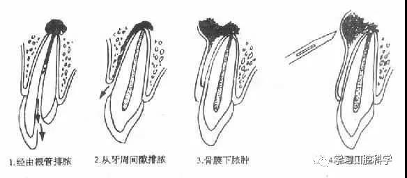

图4 急性化脓性根尖周炎排脓途径

由于牙根长短和根尖解剖部位不同，排脓途径各不相同，形成窦道的部位亦各不同。上颌中切牙的牙槽突很低而牙根长时，脓液穿通鼻腔底；上颌侧切牙根尖常偏向舌侧，脓液可穿破腭侧骨板而形成腭侧脓肿；上颌后牙牙根与上颌窦底部接近，有时脓液可穿入上颌窦；上颌磨牙腭根脓肿，甚至可由骨膜下向后扩展到软腭；而下颌切牙可引起颏部肿胀；下颌磨牙根较长时，脓液在颌舌骨肌附丽下，向口底软组织扩散，引起严重口底蜂窝组织炎，颌骨骨髓炎，偶可导致海绵窦血栓。

脓液进入骨髓腔时，疼痛非常剧烈，呈持续性、搏动性，患牙松动严重，触、叩痛明显、龈及面部肿胀，根端红肿压痛，牙伸长感，不敢对牙合，头痛，体温升高，烦燥，痛苦面容，所属淋巴结肿大、压痛。形成粘膜下脓肿后，由于颌骨内部压力降低，疼痛明显减轻，但软组织水肿仍明显。若未切开引流，则自行破溃流脓。从炎症开始至形成粘膜下脓肿约3-5日。

### （二）慢性根尖周炎（chronic apical periodontitis）

慢性根尖周炎是指根管内由于长期有感染和病原刺激存在，根尖周组织呈现慢性炎症反应，分为根尖周肉牙肿、慢性根尖周脓肿和根尖周囊肿。

【治疗】

（一）应急处理

根尖部急性炎症的外置，是一种应急临时性措施，主要是缓解疼痛及消除肿胀，待转为慢性炎症后再作常规治疗。应急治疗的关键是掌握病变发展阶段，病变程度。

1．髓腔开放引流

2．切开排脓

3．按抚治疗

4．调牙合磨改

5．消炎止痛

（二）根管治疗术

## 牙周疾病重点

牙周病是指发生在牙齿周围组织的疾病。根据病变侵犯的部位分为龈炎和牙周炎两类。龈炎的病变主要发生在牙龈组织。牙周炎的病变则同时侵犯牙龈、牙周膜、牙槽骨和牙骨质。本病在早期多无自觉症状，易被忽视，往往在发展较为严重时才被发现。因此，定期检查，及早发现，早期治疗有重要意义。

### 一、病因

牙周病的病因比较复杂，总的分为局部和全身两方面的因素。局部因素具有相当重要的作用，全身因素可影响牙周组织对局部刺激的反应，两者之间有密切关系。

局部因素

1．菌斑是指粘附于牙齿表面的微生物群，不能用漱口、水冲洗等去除。现已公认，菌斑是牙周病的始动因子，是引起牙周病的主要致病因素。

2．牙石是沉积在牙面上的矿化的菌斑。牙石又根据其沉积部位和性质分为龈上牙石和龈下牙石两种。龈上牙石位于龈缘以上的牙面上，肉眼可直接看到。在牙颈部沉积较多，特别在大涎腺导管开口相对处如上颌磨牙的颊侧和下颌前牙的舌侧沉积更多。龈下牙石位于龈缘以下、龈袋或牙周袋内的根面上，肉眼不能直视，必须用探针探查，方能知其沉积部位和沉积量。龈下牙石在任何牙上都可形成，但以邻面和舌面较多。

龈上牙石中无机盐的主要来源是唾液中的钙、磷等矿物盐。龈下牙石主要是龈沟液和渗出物提供矿物盐。

牙石对牙周组织的危害，主要是它构成了菌斑附着和细菌滋生的良好环境。牙石本身妨碍了口腔卫生的维护，从而更加速了菌斑的形成，对牙龈组织形成刺激。

3．创伤性咬合在咬合时，若咬合力过大或方向异常，超越了牙周组织所能承受的合力，致使牙周组织发生损伤的咬合，称为创伤性咬合。创伤性咬合包括咬合时的早接触、牙合干扰、夜间磨牙等。

4．其他包括食物嵌塞、不良修复物、口呼吸等因素也促使牙周组织的炎症过程。

全身因素

牙周病的发生，局部因素是主要的。全身因素在牙周病的发展中属于促进因子，全身因素可以降低或改变牙周组织对外来刺激的抵抗力，使之易于患病，并可促进龈炎和牙周炎的发展。

全身因素包括有：内分泌失调、如性激素、肾上腺皮质激素、甲状腺素等的分泌量异常。饮食和营养方面可有维生素C的缺乏、维生素D和钙、磷的缺乏或不平衡、营养不良等。血液病与牙周组织的关系极为密切，白血病患者常出现牙龈肿胀、溃疡、出血等。血友病可发生牙龈自发性出血等。某些药物的长期服用如苯妥英钠可使牙龈发生纤维性增生；某些类型的牙周病如青少年牙周炎患者往往有家族史，因而考虑有遗传因素。总之，牙周病的病因比较复杂，在治疗时不仅要注意局部因素的消除，也要考虑到全身的状态，以便获得较好的治疗效果。

### 二、慢性龈炎（Chronic Gingivitis）

慢性龈炎病变主要局限于牙龈的边缘及龈乳头，不波及深层牙周组织。主要局部刺激因素所引起，如菌斑、牙石、食物嵌塞和不良修复物等。

临床表现

自觉症状不明显，偶有牙龈炎、痒感、或有口臭。当有局部刺激时如刷牙、咬硬食物和吮吸等，可出现牙龈出血。患者往往因此就诊。检查可见有牙石附着于牙颈部。牙龈颜色由淡红色变为深红色。牙龈质地松软并可有轻度肿胀，以致使牙龈边缘变厚，龈乳头变圆钝。探诊时牙龈易出血。

### 三、青春期龈炎、妊娠期龈炎和药物性牙龈肥大

青春期龈炎是牙龈组织受到长期的局部刺激所引起的慢性炎症，表现以牙龈明显的炎性肿胀、增生为特征。病变可累及附着龈。见于青春期，以上下颌前牙唇侧牙龈为好发部位。

病因

除引起慢性龈炎的局部因素外，尚可有口呼吸、牙齿排列或咬合的异常。青春期内分泌的改变，特别是性激素的变化，也易诱发本病。

临床表现

牙龈肿胀肥大，呈深红色或暗红色，组织松软，探诊易出。牙龈乳头呈球状突起（附图1）。肿胀的牙龈常可覆盖前牙唇的1/3或更多。由于牙龈肥大，使龈沟加深而形成龈袋，袋内易藏食物，细菌易滋生，自洁作用差，故炎症加重，可有深性分泌物。若身体抵抗力降低时，可出现单发或多发性的龈脓肿，特别以龈乳头区较多见。

 

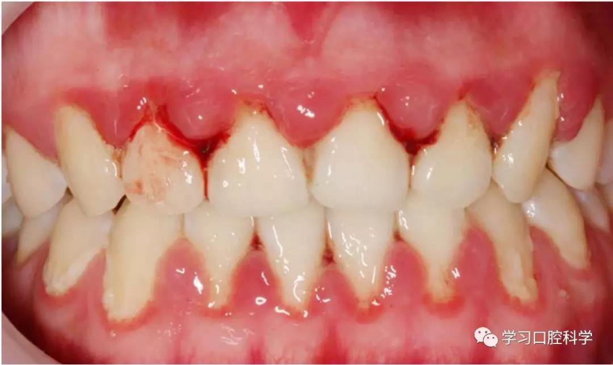

图1 青春期龈炎

自觉症状可有刺激性牙龈出血、发胀、口臭等。病变后期，因纤维增生而使牙龈质地较为坚韧，炎症也有减轻，又称增生性龈炎。

妊娠期间发生的龈炎，称妊娠期龈炎（Pregnancygingivitis）。有时个别龈乳头肿胀成球状且常带蒂，称妊娠期龈瘤。分娩后，肥大的牙龈一般可自行消退。

某些系统性疾病也可出现牙龈的肥大或增生改变。应注意鉴别，如：

白血病由于白细胞增多，在末梢血管内淤积，造成牙龈肿胀和肥大，龈色苍白，如伴有炎症则龈缘充血并有渗血现象。病情严重者，龈乳头或龈缘出现坏死，并有口臭。

维生素C缺乏性龈炎。整个牙龈呈紫红色，易出血。重者，龈缘坏死，口臭明显。

长期服用苯妥英纳的病员，可出现牙龈增生，其特征是颊、舌侧牙龈同时增生，呈结节状，质坚实，色浅淡，不易出血（图2）。

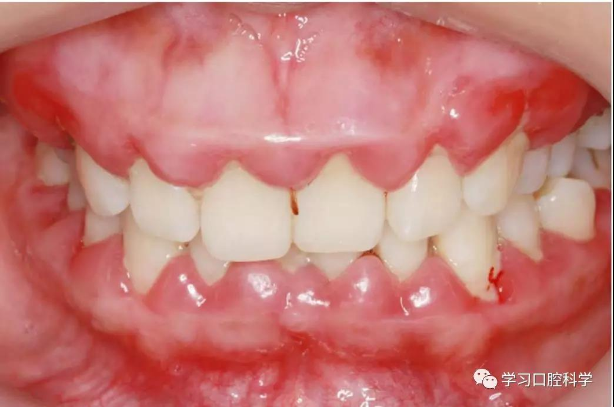

图2 内服苯土英钠后牙龈增生

### 四、慢性牙周炎（Chronic Periodontitis）

慢性牙周炎是指主要由局部因素引起的牙周支持组织的慢性炎症。发病年龄以35岁以后较为多见。常由龈炎进一步发展而来，如龈炎未能及时治疗，炎症可由牙龈向深层扩散到牙周膜、牙槽骨和牙骨质而为牙周炎。由于早期多无明显自觉症状而易被忽视，待有症状就诊时往往已较严重，甚至已不能保留牙齿。因而必须加强宣教，使患者早期就诊和及时治疗。

慢性牙周炎的病因与龈炎基本相同，包括菌斑、牙石、食物嵌塞及不良修复物等因素。此外，若同时伴有较明显的咬合创伤，可加重牙周组织的破坏。

临床表现

早期自觉症状不明显，患者常只有激发生性牙龈出血或口臭的表现，与龈炎症状相似。检查时可见龈缘、龈乳头和附着龈的肿胀、质松软，呈深红色或暗红色，探诊易出血。随着炎症的进一步扩散，出现下列症状：

牙周袋形成：由于炎症的扩展，牙周膜被破坏，牙槽骨逐渐吸收，牙龈与牙根分离，使龈沟加深而形成牙周袋。可用探针测牙周袋深度。X线检查时可发现牙槽骨有不同程度的吸收。如图3-7.

牙周溢脓：牙周袋壁有溃疡及炎症性肉芽组织形成，袋内有脓性分泌物存留，故轻按牙龈，可见溢脓。并常有口臭：

牙齿松动：由于牙周组织被破坏，特别是牙槽骨吸收加重时，支持牙齿力量不足，出现牙齿松动、移位等现象。

此时患者常感咬合无力、钝痛，牙龈出血和口臭加重。当机体抵抗力降低、牙周袋渗液引流不畅时，可形成牙周胀肿。此时牙龈呈卵圆形突起，发红肿胀，牙齿松动度增加，有叩痛。患者感局部剧烈跳痛，有时同时出现多个部位的脓肿，称多发性牙周脓肿。此时患者可有体温升高、全身不适，颌下淋巴结肿大、压痛等症状。

| 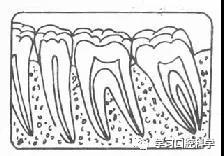 | 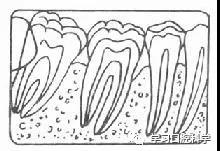 |
| -------------------- | -------------------- |
| 图3 正常牙槽骨       | 图4牙槽骨Ⅰ度吸收     |
| 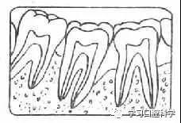 | 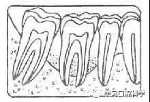 |
| 图5 牙槽骨Ⅱ度吸收    | 图6 牙槽骨Ⅲ度吸收    |
| 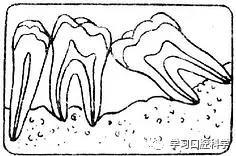 |                      |
| 图7 牙槽骨Ⅳ度吸收    |                      |

### 五、侵袭性牙周炎（agrgressive periodontitis）

侵袭性牙周炎病情发展较快。病因尚未完全清楚。局部因素主要为特异性细菌的感染。全身因素主要是机体防御能力缺陷特别是患者周围血的中性多形核白细胞趋化功能的异常。若同时存在其他的局部因素时，则可加重病情的发展。

侵袭性牙周炎患病率低，约为0.1～3.4％，女性多于男性，发病年龄是在青春期，由于年龄小，易被忽视，就诊时病情常已较严重，以致在青年时期就可丧失牙齿，影响了患者的身心健康。因此，进行普查、早期防治是医务工作者的重要职责。

临床表现

一般分为两种类型：1.局限型青少年牙周炎。病变局限于切牙和第一磨牙。2.泛发型青少年牙周炎。病损波及全口多数牙齿。

病变早期就可出现牙齿的松动、移位，特别是上颌切牙和第一磨牙更为明显，严重时上颌前牙呈扇形展开。形成深而窄的牙周袋，X线片显示有牙槽骨的吸收，常纵型和横型吸收并存。但牙龈炎症往往不明显，口腔卫生情况一般较好。当病情继续发展，菌斑和牙石增多，牙龈炎症明显时，所出现的症状同慢性牙周炎。

治疗

牙周炎的治疗是由一系列的综合治疗措施来完成的。为了巩固疗效、防止复发，应进行口腔卫生的宣教，定期复查，必要时再予以适当的治疗，如刮除菌斑、牙石或药物治疗等。

 